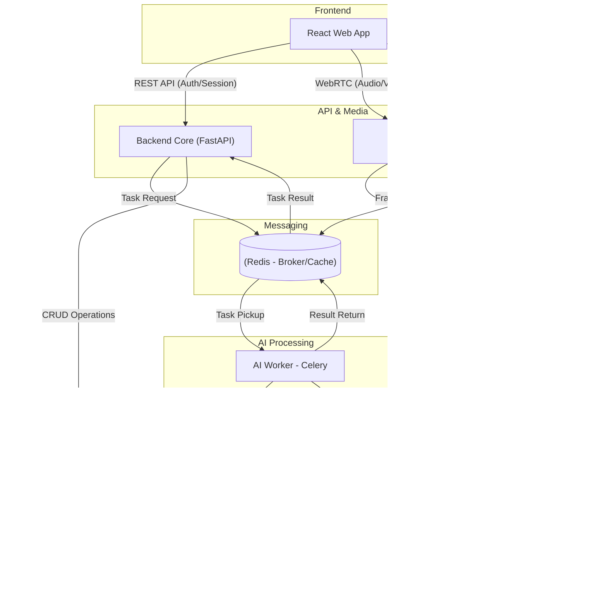
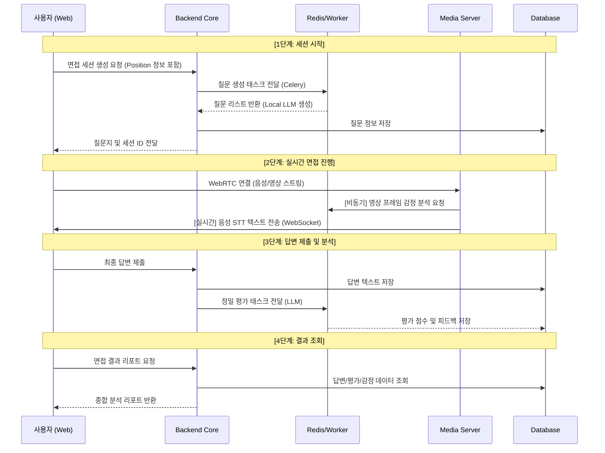

```mermaid
graph TD
    subgraph Client_Side [Frontend]
        FE[React Web App]
    end

    subgraph Service_Layer [API & Media]
        BE["Backend Core (FastAPI)"]
        MS["Media Server (aiortc/FastAPI)"]
    end

    subgraph Task_Queue [Messaging]
        RD[("(Redis - Broker/Cache)")]
    end

    subgraph AI_Engine [AI Processing]
        AW[AI Worker - Celery]
        LLM["Local LLM (Solar 10.7B)"]
    end

    subgraph Storage [Persistent Data]
        DB[("(PostgreSQL + pgvector)")]
    end

    subgraph External_APIs [Third-party Services]
        DG["Deepgram (Real-time STT)"]
        HF[HuggingFace Hub]
    end

    %% 연결 관계
    FE -- "REST API (Auth/Session)" --> BE
    FE -- "WebRTC (Audio/Video)" --> MS
    FE -- "WebSocket (Real-time STT)" --> MS

    MS -- "Stream Audio" --> DG
    DG -- "Text Response" --> MS
    MS -- "Frame Data (Celery Task)" --> RD

    BE -- "Task Request" --> RD
    RD -- "Task Pickup" --> AW
    AW -- "LLM Inference" --> LLM
    AW -- "Result Return" --> RD
    RD -- "Task Result" --> BE

    BE -- "CRUD Operations" --> DB
    AW -- "Save Evaluation/Emotion" --> DB

    LLM -- "Download/Verify" --> HF
```

```mermaid
sequenceDiagram
    participant User as 사용자 (Web)
    participant BE as Backend Core
    participant RD as Redis/Worker
    participant MS as Media Server
    participant DB as Database

    Note over User, DB: [1단계: 세션 시작]
    User->>BE: 면접 세션 생성 요청 (Position 정보 포함)
    BE->>RD: 질문 생성 태스크 전달 (Celery)
    RD-->>BE: 질문 리스트 반환 (Local LLM 생성)
    BE->>DB: 질문 정보 저장
    BE-->>User: 질문지 및 세션 ID 전달

    Note over User, DB: [2단계: 실시간 면접 진행]
    User->>MS: WebRTC 연결 (음성/영상 스트림)
    MS->>RD: [비동기] 영상 프레임 감정 분석 요청
    MS->>User: [실시간] 음성 STT 텍스트 전송 (WebSocket)

    Note over User, DB: [3단계: 답변 제출 및 분석]
    User->>BE: 최종 답변 제출
    BE->>DB: 답변 텍스트 저장
    BE->>RD: 정밀 평가 태스크 전달 (LLM)
    RD-->>DB: 평가 점수 및 피드백 저장

    Note over User, DB: [4단계: 결과 조회]
    User->>BE: 면접 결과 리포트 요청
    BE->>DB: 답변/평가/감정 데이터 조회
    BE-->>User: 종합 분석 리포트 반환
```
