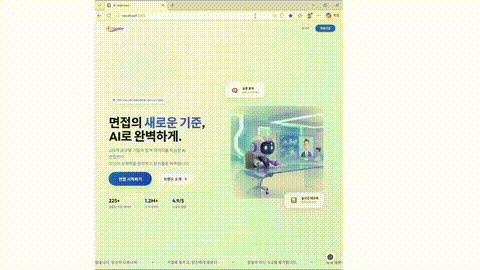
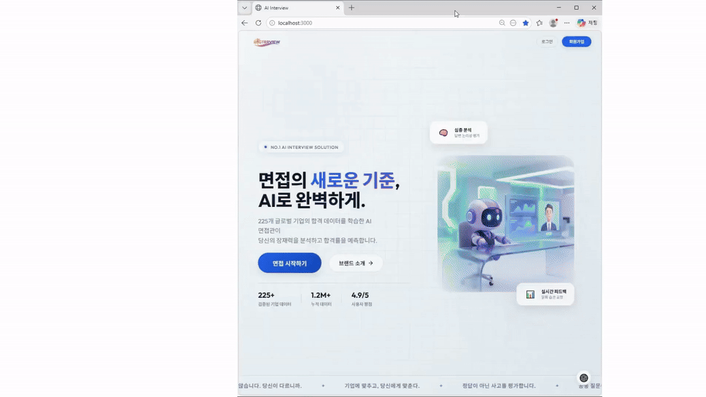
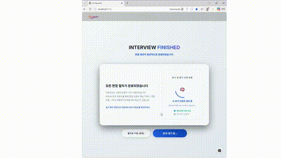
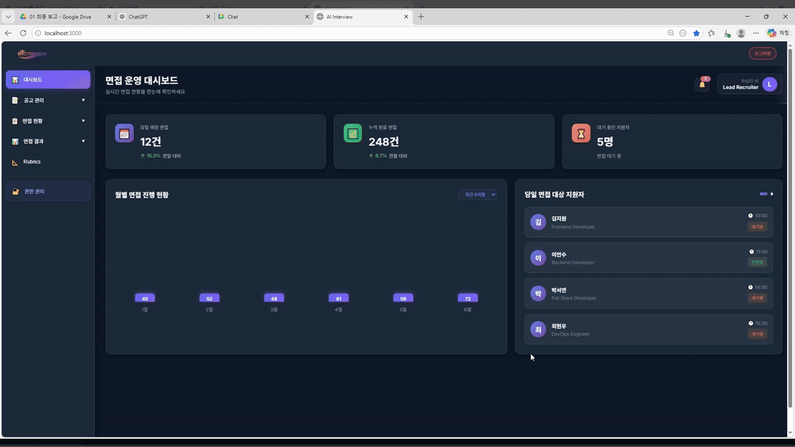
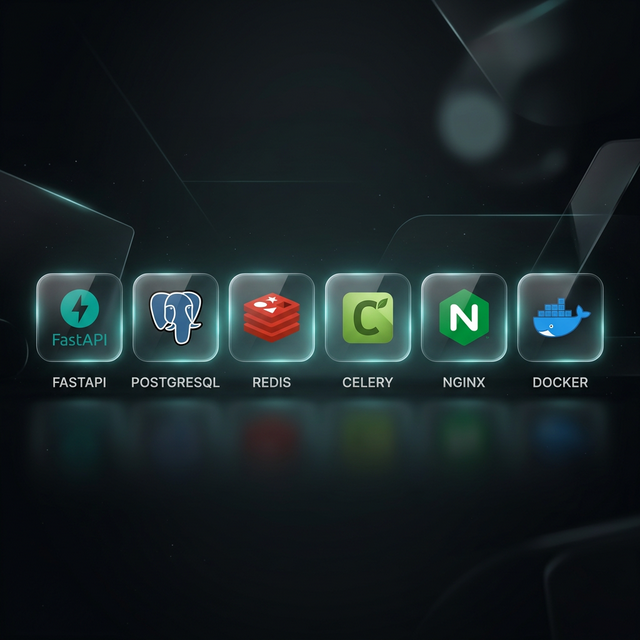
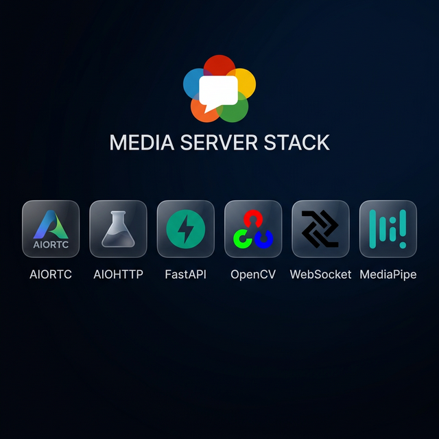
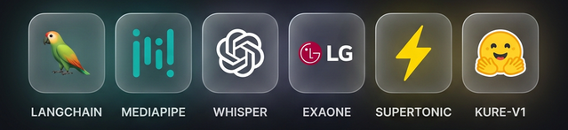
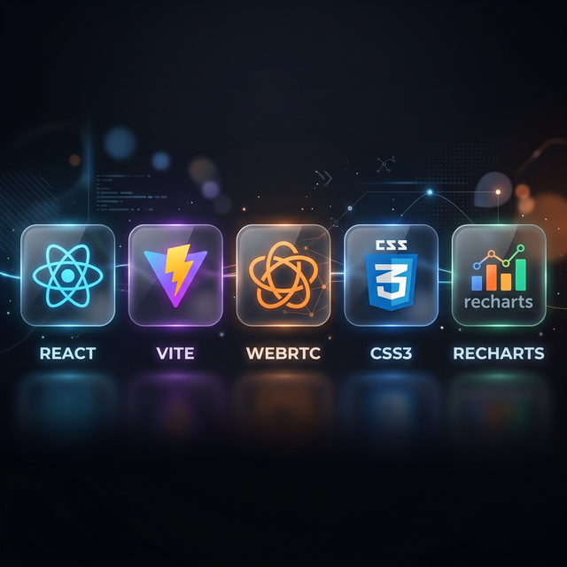
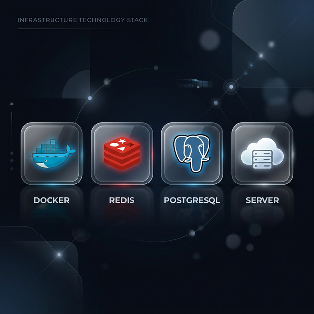

# 🎯 Big20 AI Interview Project

**AI 기반 실시간 면접 시스템** - 맞춤형 질문 생성, 실시간 평가, 영상 기반 감정·시선 분석

[](https://www.python.org/)
[](https://fastapi.tiangolo.com/)
[](https://reactjs.org/)
[](https://www.docker.com/)
[](https://www.postgresql.org/)
[-brightgreen.svg)](#-품질-현황)

---

## 🎥 데모 영상 (Demo Videos)

### 🎥 1. 면접 준비 (Interview Prep)
> **이력서 업로드 및 RAG 기반 질문 생성 준비**



---

### 🎥 2. 실시간 면접 진행 (Live Interview)
> **WebRTC 영상 스트리밍 및 실시간 감정·시선·음성 분석**



---

### 🎥 3. AI 평가 결과 (Evaluation Report)
> **종합 데이터 기반 평가 리포트 및 피드백 생성**



---

### 🎥 4. 관리자 페이지 (Admin Panel)
> **지원자 관리, 이력서 벡터 검색 및 면접 결과 모니터링**



---

## 📋 목차

1. [데모 영상](#-데모-영상-demo-videos)
2. [프로젝트 개요](#-프로젝트-개요)
3. [주요 기능](#-주요-기능)
4. [시스템 아키텍처](#️-시스템-아키텍처)
5. [프로젝트 구조](#-프로젝트-구조)
6. [빠른 시작](#-빠른-시작)
7. [기술 스택](#️-기술-스택)
8. [개발 가이드](#-개발-가이드)
9. [품질 현황](#-품질-현황)
10. [보안](#-보안)
11. [산출물](#-산출물-deliverables)
12. [기여 가이드](#-기여-가이드)
13. [팀](#-팀)

---

## 🎯 프로젝트 개요

Big20 AI Interview Project는 **AI 기술을 활용한 차세대 면접 시스템**입니다.

지원자가 웹 브라우저에서 WebRTC 기반 화상 면접을 진행하면, AI가 실시간으로 영상·음성·답변 내용을 분석하여 종합 평가 리포트를 생성합니다.

### 핵심 가치

- ✅ **맞춤형 질문 생성**: 이력서·직무·회사 데이터를 종합한 RAG 기반 개인화 질문
- ✅ **실시간 STT**: Whisper 모델 기반 한국어 실시간 전사
- ✅ **AI 질문 음성 안내**: Supertonic-2 TTS를 통한 면접관 음성 합성
- ✅ **영상 분석**: MediaPipe FaceLandmarker를 이용한 시선·자세·감정 실시간 분석 (5FPS)
- ✅ **AI 평가**: EXAONE-3.5 LLM 기반 답변 평가 및 종합 리포트
- ✅ **확장 가능한 구조**: GPU/CPU 이중 워커 기반 마이크로서비스 아키텍처
- ✅ **직무 전환자 지원**: 경력 전환 감지 및 맞춤형 면접 시나리오 자동 분기
- ✅ **세션 복구**: 새로고침 시 `sessionStorage`로 진행 상태 자동 복구

---

## 🚀 주요 기능

### 1. **이력서 기반 질문 생성**

- **pdfplumber** 및 **python-docx**를 활용한 PDF 이력서 자동 파싱
- 섹션별 임베딩 (경력, 프로젝트, 기술 스택 등)
- **KURE-v1** (1024차원) 기반 고성능 한국어 문장 임베딩 및 RAG 검색
- 회사 정보 연계 질문 생성
- 직무 전환자 감지 → 전환자 전용 시나리오 자동 적용 (`check_if_transition()`)
- 질문 생성 fallback 로직: LLM 오류 시 템플릿 자동 사용

### 2. **실시간 면접 진행**

- WebRTC 기반 영상/음성 스트리밍
- **Faster-Whisper STT** (`large-v3-turbo`): 메인 음성 인식 경로 (Media-Server → AI-Worker)
- AI 질문 스트리밍: `Redis Pub/Sub` → `WebSocket` 토큰 스트리밍 (타이핑 효과)
- Supertonic-2 TTS (질문 음성 자동 재생, Fire-and-Forget 비동기)
- 실시간 시선·자세·감정 분석 (MediaPipe FaceLandmarker, 5FPS)
- STT 다중 가드 로직: `isAcceptingSTTRef`, `isTranscriptLockedRef`, `isSttProcessingRef`
- 세션 복구: 새로고침 시 `sessionStorage`로 진행 상태 자동 복구

### 3. **AI 평가 시스템**

- EXAONE-3.5-7.8B-Instruct-Q4_K_M.gguf 
- 기술적/행동적/종합 역량 분석
- 질문별 영상(시선·자세·감정) + 음성 자신감 가중합 채점 (RMS 기반)
- Redis 실시간 긴장도(`anxiety`) 저장 및 모니터링
- PDF 다운로드 가능한 종합 평가 리포트 생성 (jsPDF + html2canvas)

### 4. **채용 담당자 / 관리자 기능**

- 지원자 이력서 벡터 유사도 검색 (pgvector)
- 면접 진행 상황 모니터링
- 평가 결과 열람 및 관리

---

## 🏗️ 시스템 아키텍처

```
┌─────────────┐    WebRTC/WS    ┌──────────────────┐
│   Frontend  │◀──────────────▶│  Media-Server    │
│  (React 18) │                │  (aiortc/FastAPI)│
│  Port:3000  │                │  Port:8080       │
└──────┬──────┘                └────────┬─────────┘
       │ WebRTC/WebSocket                │ Celery Task
       │ (Media-Server 위임)              │ (STT, 영상분석)
       ▼                                ▼
┌──────────────┐    Celery     ┌─────────────────────────────┐
│ Backend-Core │──────────────▶│       AI-Worker             │
│  (FastAPI)   │               │  ┌──────────┐ ┌──────────┐ │
│  Port:8000   │               │  │ GPU Worker│ │CPU Worker│ │
└──────┬───────┘               │  │(질문생성) │ │(STT/TTS) │ │
       │  Redis Pub/Sub        │  └──────────┘ └──────────┘ │
       │  (AI 질문 스트리밍)    └─────────────────────────────┘
       ▼                                  │
┌──────────────┐◀─────────────────────────┘
│  PostgreSQL  │   (평가 결과, 영상 분석 점수 저장)
│  18+pgvector │
└──────────────┘
       ▲
┌──────┴───────┐
│    Redis 7   │  (Task Broker + Result Backend + AI 스트리밍 Pub/Sub + 분산 락)
└──────────────┘
```

### 마이크로서비스 구성

| 서비스 | 역할 | 기술 스택 | 포트 |
|--------|------|-----------|------|
| **Frontend** | 사용자 인터페이스 | React 18, Vite, WebRTC | 3000 |
| **Backend-Core** | API 서버, 인증, 라우팅 | FastAPI, SQLModel, JWT | 8000 |
| **AI-Worker (GPU)** | 질문 생성, 이력서 임베딩, 평가 | Celery, LangChain, EXAONE-3.5, KURE-v1 | - |
| **AI-Worker (CPU)** | STT, TTS, 이력서 파싱 | Celery, Faster-Whisper, Supertonic-2 | - |
| **Media-Server** | WebRTC 중계, 영상 분석, STT 위임 | aiortc, MediaPipe FaceLandmarker | 8080 |
| **PostgreSQL** | 데이터베이스 + 벡터 검색 | PostgreSQL 18 + pgvector | 5432 |
| **Redis** | 메시지 브로커, 결과 백엔드, AI 스트리밍, 분산 락 | Redis 7-alpine | 6379 |

### AI-Worker 큐 분리 구조

| 큐 이름 | 담당 Worker | 주요 Task |
|---------|-------------|-----------|
| `gpu_queue` | ai-worker-gpu | 질문 생성 (EXAONE LLM), 이력서 임베딩 (KURE-v1), 답변 평가 |
| `cpu_queue` | ai-worker-cpu | STT (Faster-Whisper), TTS (Supertonic-2), 이력서 파싱 (pdfplumber, docx) |
| `celery` (default) | ai-worker-cpu | 기타 경량 작업 |

> **Redis 분산 락**: TTS 중복 생성 방지 (`lock:tts:{question_id}`, `SET NX` 원자적 획득)

---

## 📁 프로젝트 구조

```
Big20_aI_interview_project/
├── backend-core/              # FastAPI 메인 API 서버
│   ├── main.py               # 앱 진입점, 라우터 등록, CORS 설정
│   ├── db_models.py          # DB 모델 (SQLModel + pgvector)
│   ├── database.py           # DB 연결 설정 + 초기 계정 시딩
│   ├── celery_app.py         # Celery 중앙 설정
│   ├── exceptions.py         # 커스텀 예외 처리 (12개 도메인별 클래스)
│   ├── routes/               # API 라우터
│   │   ├── auth.py          # 인증 (JWT 토큰 발급, 회원가입/탈퇴)
│   │   ├── users.py         # 사용자 정보 (프로필, 비밀번호 변경)
│   │   ├── interviews.py    # 면접 생성·진행·평가 (AI 스트리밍 WS 포함)
│   │   ├── resumes.py       # 이력서 업로드·파싱·임베딩
│   │   ├── transcripts.py   # 대화 기록 (STT 결과 저장)
│   │   ├── companies.py     # 회사 정보
│   │   └── stt.py          # STT 위임 엔드포인트
│   ├── config/              # 면접 시나리오 설정
│   │   ├── interview_scenario.py           # 표준 경력자 시나리오
│   │   └── interview_scenario_transition.py # 직무 전환자 시나리오
│   ├── utils/               # 유틸리티
│   │   ├── auth_utils.py    # JWT 발급, bcrypt 비밀번호 해싱
│   │   ├── interview_helpers.py # 면접 보조 함수
│   │   └── rubric_generator.py  # 평가 루브릭 생성
│   ├── data/                # 초기 데이터 (기업·직무 정보 JSON)
│   └── tests/               # 테스트 코드 (18개 테스트 케이스)
│       ├── conftest.py      # SQLite In-Memory + 의존성 오버라이드
│       ├── test_auth.py     # 인증 테스트 (9개)
│       └── test_interview.py # 면접 테스트 (9개)
│
├── ai-worker/                # Celery Worker (GPU + CPU 이중 구조)
│   ├── main.py              # Worker 실행부 + 큐 라우팅 설정
│   ├── db.py                # DB 연결 + 헬퍼 함수
│   ├── tasks/               # Celery Task 모음
│   │   ├── question_generator.py  # 질문 생성 (EXAONE/Solar LLM + LangChain)
│   │   ├── evaluator.py          # 답변 평가 + 종합 리포트 생성
│   │   ├── parse_resume.py       # 이력서 파싱 (pdfplumber / python-docx)
│   │   ├── resume_embedding.py   # 섹션별 벡터 임베딩 (KURE-v1)
│   │   ├── resume_parser.py      # 이력서 텍스트 파서
│   │   ├── chunking.py          # 텍스트 청킹 (RAG 전처리)
│   │   ├── embedding.py         # 임베딩 유틸리티
│   │   ├── pgvector_store.py    # 벡터 DB 저장/검색
│   │   ├── rag_retrieval.py     # RAG 검색 로직
│   │   ├── stt.py               # STT (Faster-Whisper large-v3-turbo)
│   │   ├── tts.py               # TTS (Supertonic-2, Redis 분산 락)
│   │   └── vision.py            # 감정 분석 위임
│   ├── config/              # AI Worker 설정
│   ├── utils/               # 유틸리티
│   │   └── vector_utils.py       # 벡터 임베딩 (KURE-v1)
│   └── tools/               # LangChain 도구
│       ├── resume_tool.py        # 이력서 검색 도구
│       └── company_tool.py       # 회사 정보 도구
│
├── media-server/            # WebRTC 미디어 서버
│   ├── main.py             # aiortc (WebRTC, WebSocket, 영상 분석, STT 위임)
│   ├── vision_analyzer.py  # MediaPipe FaceLandmarker (시선·자세·감정)
│   ├── model_repository/   # face_landmarker.task 모델 파일
│   └── requirements.txt
│
├── frontend/                # React 18 프론트엔드 (Vite)
│   ├── src/
│   │   ├── App.jsx         # 메인 앱 (라우팅, WebRTC, 상태 관리 통합, ~1,400줄)
│   │   ├── index.css       # 글로벌 스타일 (Glassmorphism)
│   │   ├── components/     # 공통 UI 컴포넌트
│   │   ├── api/            # API 클라이언트
│   │   │   └── interview.js # 면접 API 클라이언트
│   │   └── pages/          # 페이지 컴포넌트
│   │       ├── landing/    # 랜딩 페이지
│   │       ├── auth/       # 로그인·회원가입
│   │       ├── main/       # 메인 대시보드
│   │       ├── interview/  # 면접 진행 (WebRTC + 실시간 분석)
│   │       ├── setup/      # 면접 환경 테스트
│   │       ├── result/     # 면접 결과·평가 리포트
│   │       ├── history/    # 면접 이력
│   │       ├── recruiter/  # 채용 담당자 대시보드
│   │       ├── profile/    # 사용자 프로필
│   │       ├── settings/   # 설정
│   │       └── about/      # 서비스 소개
│   └── public/
│       └── deepgram-processor.js  # AudioWorklet (실시간 STT 오디오 처리)
│
├── docs/                    # 프로젝트 문서
│   └── 개발문서/
│       ├── SYSTEM_SPECIFICATION.md       # 시스템 명세
│       ├── RESUME_EMBEDDING_GUIDE.md     # 이력서 임베딩 가이드
│       ├── SECURITY_GUIDE.md             # 보안 가이드
│       ├── DB_INSERT_GUIDE.md            # DB 데이터 삽입 가이드
│       ├── DB_CONNECTION_STANDARD.md     # DB 연결 표준 가이드
│       ├── STT_IMPLEMENTATION_COMPLETE.md # STT 구현 가이드 (Whisper)
│       ├── LangChain_Architecture_Guide.md # LangChain 아키텍처
│       ├── TROUBLESHOOTING.md            # 문제 해결 가이드
│       ├── QUALITY_SUMMARY.md            # 코드 품질 분석 결과
│       └── QUALITY_INSPECTION_REPORT.md  # 상세 품질 검사 리포트
│
├── infra/                   # 인프라 설정
│   └── postgres/init.sql    # DB 초기화 스크립트 (pgvector extension 활성화)
├── scripts/                 # 유틸리티 스크립트
├── docker-compose.yml       # 서비스 오케스트레이션 (7개 서비스)
├── .env                     # 환경 변수 (Git 제외 ← .gitignore)
├── .env.example             # 환경 변수 예시 (Git 포함)
├── commit_convention.md     # 커밋 메시지 컨벤션
└── README.md                # 프로젝트 문서 (이 파일)
```

---

## 🚀 빠른 시작

### 1️⃣ 사전 요구사항

- **Docker** 및 **Docker Compose** 설치
- **Git** 설치
- **최소 시스템 사양**:
  - RAM: 16GB 이상
  - GPU: NVIDIA GPU (VRAM 8GB+) 권장 — GPU 없이도 CPU 모드로 동작 가능
  - 디스크: 최소 50GB 이상 여유 공간 (LLM 모델 포함)

### 2️⃣ 환경 설정

```bash
# 1. 저장소 클론
git clone https://github.com/jaemin1020/Big20_aI_interview_project.git
cd Big20_aI_interview_project

# 2. 환경 변수 파일 생성 (.env.example 복사)
cp .env.example .env
```

`.env` 파일을 열어 아래 값을 실제 값으로 설정합니다:

```env
# Database
POSTGRES_USER=admin
POSTGRES_PASSWORD=your_secure_password
POSTGRES_DB=interview_db
DATABASE_URL=postgresql+psycopg://admin:your_secure_password@db:5432/interview_db

# Redis
REDIS_URL=redis://redis:6379/0

# AI API Keys
HUGGINGFACE_HUB_TOKEN=hf_xxxxxxxxxxxx   # HuggingFace 모델 다운로드
DEEPGRAM_API_KEY=xxxxxxxxxxxx            # Deepgram STT (선택사항, 대기용)

# LangSmith (선택, 모니터링용)
LANGCHAIN_TRACING_V2=true
LANGCHAIN_ENDPOINT=https://api.smith.langchain.com
LANGCHAIN_API_KEY=ls_xxxxxxxxxxxx
LANGCHAIN_PROJECT=Big20-AI-Interview

# JWT
SECRET_KEY=your_random_secret_key       # openssl rand -hex 32 로 생성
ALGORITHM=HS256
ACCESS_TOKEN_EXPIRE_MINUTES=60

# Frontend API URLs
VITE_API_URL=http://localhost:8000
VITE_WS_URL=ws://localhost:8080
VITE_WEBRTC_URL=http://localhost:8080

# Backend Public URL (미디어 서버 → 백엔드 통신용)
BACKEND_PUBLIC_URL=http://localhost:8000
```

> ⚠️ **보안 주의**: `.env` 파일은 Git에 절대 커밋하지 마세요. `.gitignore`에 이미 포함되어 있습니다.

### 3️⃣ 서비스 실행

```bash
# 전체 서비스 빌드 & 시작 (최초 실행 시 LLM 모델 다운로드로 수 분 소요)
docker-compose up --build

# 백그라운드 실행
docker-compose up -d

# 로그 확인
docker-compose logs -f

# 특정 서비스 로그
docker-compose logs -f ai-worker-cpu   # STT/TTS 워커
docker-compose logs -f ai-worker-gpu   # 질문 생성 워커
docker-compose logs -f media-server    # 영상 분석 서버
```

### 4️⃣ 서비스 접속

| 서비스 | URL | 설명 |
|--------|-----|------|
| **Frontend** | http://localhost:3000 | 웹 인터페이스 |
| **Backend API** | http://localhost:8000 | REST API |
| **API Docs (Swagger)** | http://localhost:8000/docs | 자동 생성 API 문서 |
| **Media Server** | http://localhost:8080 | WebRTC 서버 |
| **Media Server 상태** | http://localhost:8080/status | Vision Analyzer 상태 확인 |

### 5️⃣ 초기 데이터 설정

```bash
# 산업군/직종 등 기초 데이터 삽입
docker-compose exec backend python populate_industry_position.py

# DB 스키마 확인
docker-compose exec backend python check_db.py
```

> **기본 계정** (DB 초기화 시 자동 생성, 프로덕션 환경에서 반드시 변경)
> - 관리자: `admin` / `admin1234`
> - 채용담당자: `recruiter` / `recruiter1234`

---

## 🛠️ 기술 스택

### Backend



| 구성요소 | 기술 | 버전 |
|---------|------|------|
| Framework | FastAPI | 0.109+ |
| ORM | SQLModel | 0.0.14+ |
| Database | PostgreSQL + pgvector | 18 |
| Task Queue | Celery + Redis | 5.4+ |
| Authentication | JWT (python-jose) | 3.3+ |
| Password | bcrypt | 4.0.1 |
| Exception Handling | 커스텀 예외 클래스 12개 | - |

### Media-Server



| 구성요소 | 기술 | 용도 |
|---------|------|------|
| Framework | FastAPI | WebRTC 제어 및 API 엔드포인트 |
| WebRTC | aiortc | 실시간 미디어 스트리밍 및 WebRTC 피어 연결 |
| Video Analysis | MediaPipe FaceLandmarker | 시선, 자세, 감정 실시간 추론 (5FPS) |
| Image Processing| OpenCV (headless) | 프레임 전처리 및 분석 보조 |
| Real-time | WebSockets | 프론트엔드와 분석 결과 실시간 동기화 |
| Networking | aiohttp | 내부 서비스 간 비동기 HTTP 통신 |

### AI / ML



| 구성요소 | 기술 | 용도 |
|---------|------|------|
| LLM | EXAONE-3.5 | 질문 생성·답변 평가 |
| Embedding | KURE-v1 (1024차원) | 한국어 이력서 및 기업 정보 임베딩 |
| PDF Parsing | pdfplumber | 이력서 텍스트 및 구조 추출 |
| STT | Faster-Whisper (`large-v3-turbo`) | 미디어 서버 → AI-Worker 위임 |
| TTS | Supertonic-2 | 텍스트→음성 (한국어) |
| Vision | MediaPipe FaceLandmarker | 시선·자세·감정 실시간 분석 (5FPS) |
| RAG Framework | LangChain | 질문 생성 파이프라인 |
| Monitoring | LangSmith | LangChain 파이프라인 트레이싱 |

### Frontend



| 구성요소 | 기술 | 버전 |
|---------|------|------|
| Framework | React | 18.2 |
| Build | Vite | 5.0 |
| Routing | React Router DOM | 6.21 |
| HTTP | Axios | 1.6 |
| Charts | Recharts | 2.15 |
| PDF 출력 | jsPDF + html2canvas | - |
| Real-time | WebRTC, WebSocket | - |
| Audio | AudioWorklet API | - |
| Styling | Vanilla CSS (Glassmorphism) | - |

### Infrastructure



| 구성요소 | 기술 |
|---------|------|
| 컨테이너 | Docker, Docker Compose |
| 메시지 브로커 | Redis 7-alpine |
| AI 스트리밍 | Redis Pub/Sub |
| 분산 락 | Redis SET NX (TTS 중복 방지) |
| 벡터 DB | pgvector (PostgreSQL extension) |
| WebRTC | aiortc 1.14 |

---

## 👨‍💻 개발 가이드

### 로컬 개발 환경 설정

#### Backend 개발

```bash
cd backend-core

# 가상환경 생성
python -m venv venv
source venv/bin/activate  # Windows: venv\Scripts\activate

# 의존성 설치
pip install -r requirements.txt

# 개발 서버 실행 (Redis, DB는 Docker로 실행 필요)
uvicorn main:app --reload --host 0.0.0.0 --port 8000
```

#### Frontend 개발

```bash
cd frontend

# 의존성 설치
npm install

# 개발 서버 실행
npm run dev
```

#### AI Worker 개발

```bash
cd ai-worker

# GPU Worker 실행 (질문 생성)
celery -A main.app worker --loglevel=info -Q gpu_queue --pool=solo

# CPU Worker 실행 (STT/TTS)
celery -A main.app worker --loglevel=info -Q cpu_queue,celery --pool=threads --concurrency=4
```

### 테스트 실행

```bash
# Backend 테스트 (18개 케이스: auth 9개, interview 9개)
cd backend-core
pytest tests/ -v

# DB 상태 확인
python check_db.py
```

### 도커 개별 서비스 재빌드

```bash
# 특정 서비스만 재빌드
docker-compose up --build media-server

# AI Worker CPU만 재시작
docker-compose restart ai-worker-cpu
```

---
## 📊 품질 현황

> **최종 검사일**: 2026-03-13 | **다음 검사 예정**: 2026-04-13

| 테이블 | 설명 |
|--------|------|
| `users` | 지원자·채용담당자·관리자 계정 및 프로필 (JWT 인증) |
| `resumes` | 이력서 파일 정보, 파싱 결과(JSONB) 및 대표 벡터(1024차원) |
| `companies` | 기업 정보, 인재상 및 기업 특징 벡터(1024차원) |
| `interviews` | 면접 세션 정보 및 상태 관리 (SCHEDULED → LIVE → COMPLETED) |
| `questions` | AI 생성 질문 은행 및 평가 루브릭(JSONB) |
| `transcripts` | 면접 대화 기록 (STT 전사, 감정 분석, 질문별 점수) |
| `evaluation_reports` | 종합 평가 리포트 (역량별 점수, 상세 피드백, LLM 요약) |
| `answer_bank` | 우수 답변 모음 및 전문가 피드백 (벡터 검색용) |

---

## 🔒 보안

자세한 보안 가이드: [`docs/개발문서/SECURITY_GUIDE.md`](docs/개발문서/SECURITY_GUIDE.md)

### 핵심 보안 사항

- ✅ `.env` 파일은 Git에 커밋하지 않기 (`.gitignore` 설정 확인)
- ✅ API 키를 코드에 하드코딩하지 않기 — 환경 변수만 사용
- ✅ JWT Secret Key는 강력한 랜덤 문자열 사용 (`openssl rand -hex 32`)
- ✅ 프로덕션 환경에서는 HTTPS 강제
- ✅ 비밀번호는 bcrypt로 해싱
- ✅ Frontend 환경 변수는 반드시 `VITE_` 접두사 사용 (Vite 보안 정책)
- ✅ 초기 계정 비밀번호(`admin1234`, `recruiter1234`)는 프로덕션 배포 전 반드시 변경
- ⚠️ `save_behavior_scores` 엔드포인트 인증 미적용 — 추후 수정 예정

---

## 📖 산출물 (Deliverables)

| 구분 | 주요 문서 | 설명 |
|------|------|------|
| **Total** | [파트별 통합 진행 보고서](docs/readmelist/SERVICE_PROGRESS.md) | **PA/SA/DA/LA/MA/SD 6대 파트 통합 진행 현황 (최종)** |
| **Results** | [최종 결과 보고서](docs/readmelist/FINAL_RESULTS.md) | 프로젝트 최종 성과물 및 핵심 성능 지표(KPI) 요약 |
| **Manual** | [사용자 메뉴얼](docs/readmelist/USER_MANUAL.md) | 서비스 이용 단계별 상세 가이드 |
| **Architecture** | [시스템 아키텍처 (SA)](docs/readmelist/SYSTEM_ARCHITECTURE.md) | 전체 시스템 설계 및 마이크로서비스 모듈 구성 |
| **AI Engine** | [AI 코어 엔진 & RAG (LA)](docs/readmelist/AI_CORE_SYSTEM.md) | EXAONE LLM 및 KURE-v1 기반 질문/평가 엔진 |
| **Streaming** | [미디어 서버 & 비전 (MA)](docs/readmelist/SIGNALING_MEDIA_SERVER.md) | WebRTC 스트리밍 및 MediaPipe 행동 분석 상세 |
| **Voice** | [음성 지능 (STT/TTS)](docs/readmelist/STT_TTS_GUIDE.md) | Faster-Whisper 및 Supertonic-2 연동 가이드 |
| **Testing** | [통합 테스트 보고서 (SD)](docs/readmelist/INTEGRATED_TEST_REPORT.md) | 18개 테스트 케이스 및 기능 검증 결과 |
| **Quality** | [코드 품질 분석 요약](docs/개발문서/QUALITY_SUMMARY.md) | 프로젝트 전체 코드 품질 및 리팩토링 현황 |
| **Quality** | [상세 품질 검사 리포트](docs/개발문서/QUALITY_INSPECTION_REPORT.md) | 단계별 정밀 품질 검사 결과 보고서 |
| **Reference** | [문제 해결 가이드](docs/개발문서/TROUBLESHOOTING.md) | 주요 이슈 및 트러블슈팅 사례 아카이브 |
| **Reference** | [보안 가이드](docs/개발문서/SECURITY_GUIDE.md) | 시스템 보안 설정 및 JWT 인증 표준 가이드 |
| **Standard** | [이력서 임베딩 가이드](docs/개발문서/RESUME_EMBEDDING_GUIDE.md) | KURE-v1 임베딩 생성 및 파이프라인 관리 |
| **Standard** | [DB 연결 표준 가이드](docs/개발문서/DB_CONNECTION_STANDARD.md) | 데이터베이스 연결 코드 및 트랜잭션 표준 |

---

---

## 🤝 기여 가이드

1. Fork the Project
2. Create your Feature Branch (`git checkout -b feature/AmazingFeature`)
3. Commit your Changes — 커밋 컨벤션 형식 준수
4. Push to the Branch (`git push origin feature/AmazingFeature`)
5. Open a Pull Request

커밋 메시지 규칙은 [`commit_convention.md`](commit_convention.md) 참조

---

## 📝 라이선스

This project is licensed under the MIT License

---

## 👥 팀

**2AI1** - AI Interview System Development

---

**Last Updated**: 2026-03-13
