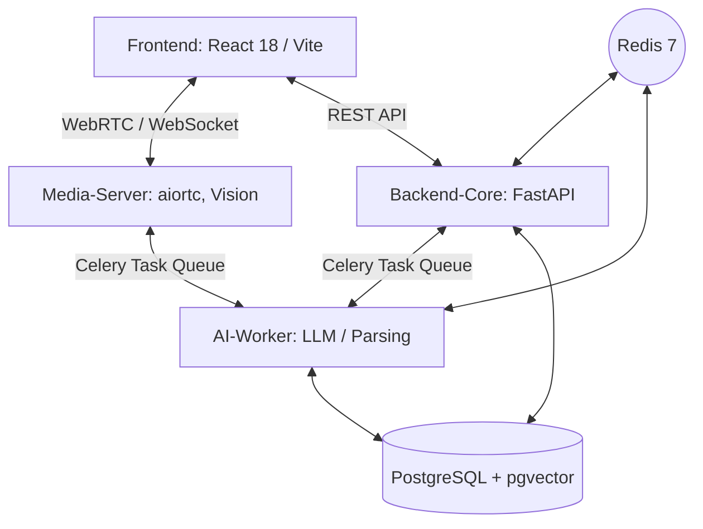

# Big20 AI 면접 시스템 설계서 (System Design Document)

## 1. 개요 (Overview)

### 1.1 문서 목적
본 문서는 **Big20 AI 면접 시스템(Big20 AI Interview Project)**의 데이터 흐름, 시스템 아키텍처, 그리고 각 모듈의 설계 세부사항을 정의하는 기술 종합 보고서입니다. 본 시스템 설계서에 기술된 사항은 실제 구현된 코드베이스 및 설계 환경 등 사실을 기반으로 작성되었습니다.

### 1.2 시스템 목적 (System Objective)
본 시스템은 최신 AI 기술(LLM, Vision AI, STT/TTS)과 실시간 웹 통신 기술(WebRTC/WebSocket)을 결합하여, 지원자의 직무 역량과 이력서를 기반으로 맞춤형 심층 면접 질문을 실시간 생성하고, 지원자의 언어적답변과 비언어적 태도를 종합적으로 분석하여 인사이트가 담긴 평가 리포트를 도출하는 것을 목적으로 합니다.

### 1.3 핵심 기능 (Core Features)
1.  **AI 기반 맞춤형 질문 생성 (RAG System)**: 이력서 파싱/임베딩 데이터를 바탕으로 지원 직무에 특화된 꼬리물기 심층 질문 생성
2.  **실시간 모의 면접 환경 제공**: WebRTC와 STT(Speech-to-Text) / TTS(Text-to-Speech)를 활용하여 자연스러운 대화 흐름 구성
3.  **다차원 태도 및 감정 분석**: Vision AI(Face Landmarker 등)를 활용하여 시선, 감정 상태 실시간 평가
4.  **종합 평가 및 피드백**: 면접 종료 후 기술/직무적 측면에 대한 정밀 평가 리포트(대시보드) 제공

---

## 2. 시스템 아키텍처 (System Architecture)

본 시스템은 높은 부하의 AI 연산을 효과적으로 분산하고, 시스템의 유연성과 확장성을 보장하기 위해 **마이크로서비스 아키텍처(MSA)**를 채택하고 있습니다.

### 2.1 전체 구성도 (Component Diagram)

### 2.2 기술 스택 (Technology Stack)

| 계층 (Layer) | 주요 기술 (Technologies) | 설명 (Description) |
| :--- | :--- | :--- |
| **Frontend** | React 18, Vite 5, Axios, Deepgram SDK | 사용자 인터페이스 제공 및 클라이언트 사이드 STT 처리 |
| **Backend-Core** | FastAPI, SQLModel | 토큰 기반 Auth(JWT), 비즈니스 로직 및 API 게이트웨이 |
| **Media-Server** | aiortc, OpenCV, MediaPipe | WebRTC 시그널링, 비디오 스트리밍 프레임 단위 실시간 비전 처리 |
| **AI-Worker (GPU/CPU)**| Celery, LangChain, PyTorch, EXAONE-3.5 | 대용량 LLM 추론(질문 생성, 평가) 및 임베딩, 문서 파싱 |
| **Database** | PostgreSQL 18, pgvector | 관계형 데이터 저장 및 고차원 임베딩/유사도 벡터 검색 지원 |
| **Message Broker** | Redis 7 | Celery 비동기 작업 큐 및 상태 관리 |
| **Infra/Deploy**| Docker, Docker Compose | 서비스 컨테이너화 및 리소스 격리 (GPU 할당) |

---

## 3. 상세 컴포넌트 설계 (Component Details)

### 3.1 Frontend (User Interface)
*   **사용자 인터페이스 (Glassmorphism 적용)**: 직관적이고 현대적인 UI/UX 제공
*   **실시간 STT 연동**: 브라우저 마이크를 통해 획득한 오디오를 Deepgram SDK / Client STT 솔루션으로 즉시 변환하여 서버에 Transcript(전사 데이터) 저장 요청 (STT 부하 분산)
*   **면접 대시보드 표시**: 면접 결과 데이터의 시각화를 위한 차트와 상세 피드백 화면 제공

### 3.2 Backend-Core (API Server)
*   **비즈니스 흐름 제어**: 면접 세션(대기, 진행, 완료)의 생명주기를 관리합니다.
*   **보안 및 인증 (Auth)**: JWT(JSON Web Token) 및 bcrypt 알고리즘을 사용한 사용자 인증 시스템. 관리자, 인사담당자, 지원자의 역할(Role) 분리 체계 구축.
*   **Database 연동**: SQLModel ORM 패러다임을 통해 비동기/동기 데이터베이스 오퍼레이션 수행

### 3.3 Media-Server (실시간 미디어 중계기)
*   **WebRTC 통신**: aiortc를 통해 STUN/TURN 서버에 의존하거나 P2P로 직접 비디오/오디오 스트림 연동을 설정.
*   **Vision Data 처리**: 클라이언트로부터 수신된 비디오 스트림에서 주기로 프레임을 추출, MediaPipe / OpenCV 등을 통해 깜박임, 시선 처리, 감정(Emotion) 상태를 1차 분석 후 필요 시 AI Worker로 위임.

### 3.4 AI-Worker (고부하 AI 작업기)
분산된 Task Queue를 통해 안정적인 연산 스케줄링 환경을 제공합니다.
*   **Question Generation (지능형 질문 생성)**:
    *   **LLM 엔진**: 로컬 양자화 모델(`EXAONE-3.5-7.8B-Instruct-Q4_K_M.gguf` 등)을 LangChain과 결합하여 운용.
    *   **로직**: 현재 면접 단계(Stage)와 이전 대화 문맥(Transcript), 자격증, 프로젝트 경험 등 추출된 이력서 데이터를 프롬프트에 동적으로 반영하여 직무/상황에 알맞은 꼬리 질문(Follow-up)을 도출합니다.
*   **Resume RAG (이력서 텍스트 마이닝)**: 문서에서 텍스트를 추출해 의미 단위로 Chunking하고 임베딩 벡터 형식(pgvector)으로 DB에 적재합니다.
*   **TTS 연동 작업**: 생성된 질문 텍스트의 불필요한 메타 태그를 정제 후 빠른 시간 안에 음성 합성(WAV 등) 파일로 변환합니다.

---

## 4. 데이터베이스 및 저장소 구조 (Database Schema)

관계형 구조 및 `pgvector` 확장을 함께 응용하여, 정형/비정형 AI 데이터를 한 곳에서 일관되게 다룹니다.

*   `users`: 시스템 사용자 계정 체계 (`candidate`, `recruiter`, `admin`) 및 해시 비밀번호.
*   `resumes`: 업로드된 이력서 원본 및 병합 파싱된 구조화 메타데이터 (JSONB 형태), 벡터 임베딩(`embedding`).
*   `companies`: 평가 대상 기업(혹은 직무군)별 특성 및 인재상 관리 데이터.
*   `interviews`: 1-Session 체계. 지원 직무(`position`), 세션 상태(`status`), 감정 요약 등 종합 지표 관리.
*   `transcripts`: 화자(AI vs. User) 단위 발화 로깅 및 개별 발화에 대한 감정 분포 기록.
*   `questions`: 카테고리(CS/역량/경험) 및 생성된 질문 내용, 질문 평가 루브릭 보관.
*   `evaluation_reports`: 면접 최종 종료 후 생성되는 정밀 평가 정보(JSONB) – 기술, 의사소통, Fit 점수.

---

## 5. 핵심 워크플로우 (Core Workflows)

1.  **사전 준비 단계 (Preparation Phase)**
    *   사용자가 이력서 업로드 → AI-Worker가 문서를 파싱/임베딩하여 DB에 RAG용 벡터(`resumes`) 저장
2.  **면접 세션 연결 (Session Connect Phase)**
    *   지원자가 면접 방 접속 시 Frontend가 WebRTC 시그널링을 Media-Server와 시작하고 세션을 `live` 상태로 전환.
3.  **대화 진행 루프 (Interaction Loop)**
    *   AI-Worker가 이력서 정보를 반영해 첫 질문 생성 → TTS 워커가 파일 렌더링 → Frontend 재생
    *   사용자가 마이크로 답변 → Frontend STT가 즉시 텍스트 변환하여 Backend에 전송 (Transcript)
    *   동시에 Media-Server가 카메라 스트림을 통해 감정 데이터 분석 
    *   Backend가 답변 완료를 감지하면, AI-Worker를 트리거해 문맥 기반의 후속 질문 반환.
4.  **세션 종료 및 종합 평가 (Termination & Evaluation Phase)**
    *   정해진 질문 수 또는 시나리오 종료 감지 시 세션 상태가 `completed`로 전환
    *   면접 전 과정의 Transcript와 다차원 데이터를 취합하여 AI-Worker 모델이 `EvaluationReports` 발급
    *   Frontend 대시보드를 통해 지원자 및 평가자에게 리포트 제공

---

## 6. 인프라 및 보안 수준 (Infra & Security Specifications)

*   **배포 아키텍처**:
    *   운영 체제 환경 독립성 확보를 위해 Docker 및 Docker Compose를 활용하여 전 모듈 컨테이너화 체계 적용.
    *   NVIDIA Container Toolkit 기반으로 AI-Worker 컴포넌트에 GPU(VRAM 자원)를 독점/분산 할당.
*   **보안 방침**:
    *   모든 인증은 Stateless 방식을 취하는 JWT 기반으로 이루어지며, 무결성 검증을 거침.
    *   민감한 API Key 및 모델 경로 파라미터는 환경 변수(`.env`)를 사용하여 소스 코드 내 하드코딩을 원천 차단.
    *   Celery Task의 Retry 정책 도입으로 네트워크나 순간 부하에 의한 데이터 유실(Faults)을 최소화.

---
**문서 작성일**: 2026년 2월 23일
**작성자**: Big20 시스템 자동화 봇
