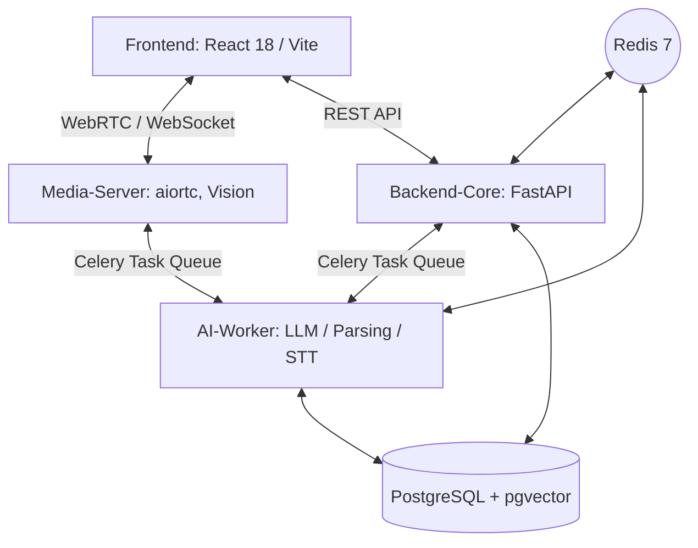

# Big20 AI 면접 시스템 설계서 (System Design Document)

## 1. 개요 (Overview)

### 1.1 문서 목적

본 문서는 **Big20 AI 면접 시스템(Big20 AI Interview Project)**의 전체 구조와 기술적 경계를 정의하는 기술 종합 설계서입니다. 기능 구현의 세부 사항이 아닌, 시스템이 안정적으로 동작하기 위한 아키텍처(인프라, 애플리케이션, 데이터, 모델, 보안, 운영/확장) 관점의 설계 원칙과 현재 프로젝트의 실장 상태를 체계적으로 기술하며, 개발자가 쉽게 이해할 수 있는 핵심 기능 명세를 제공합니다.

### 1.2 시스템 목적 (System Objective)

본 시스템은 최신 AI 기술(LLM, Vision AI, STT/TTS)과 실시간 웹 통신 기술(WebRTC/WebSocket)을 결합하여, 실제 면접과 유사한 환경을 제공하고 면접자의 직무 역량(답변)과 비언어적 태도(시선, 감정 등)를 실시간으로 분석하여 핵심 인사이트가 담긴 종합 평가 피드백을 제공하는 것을 목적으로 합니다.

### 1.3 핵심 기능 요약 (Core Features)

1. **AI 기반 맞춤형 질문 생성 (RAG System)**: 업로드된 이력서의 파싱/임베딩 데이터와 기업 인재상을 바탕으로 직무에 특화된 심층 꼬리물기 질문 도출
2. **실시간 모의 면접 환경 제공**: WebRTC와 STT 기능을 활용하여 지연 없는 대화 기반 인터페이스 구성
3. **다차원 태도 및 감정 분석**: 미디어 스트리밍을 통한 Vision AI 분석으로 시선, 깜빡임 및 감정 상태 실시간 평가 추적
4. **종합 평가 및 피드백 대시보드**: 면접 종료 후 기술적 전문성/의사소통 측면에 대한 정밀 평가 리포팅 기능

---

## 2. 시스템 아키텍처 관리 범위 및 설계 (Architecture)

본 시스템은 유연성과 확장성, 그리고 고부하 연산 처리를 병렬화하기 위해 **마이크로서비스 아키텍처(MSA)**를 채택하고 있으며, 아키텍처 관리 범위의 6대 요소를 기준으로 논리적 구조를 설계하였습니다.

### 2.1 인프라 아키텍처 (Infrastructure Layer)

시스템이 물리적·논리적으로 어디에서, 어떻게 실행되는지를 정의합니다.

* **배포 방식**: 컨테이너화된 격리 환경을 보장하기 위해 **Docker & Docker Compose**를 활용하며 전 서비스 모듈의 종속성을 해결합니다.
* **컴포넌트 및 역할 분리**: 무거운 AI 모델 로드 및 연산을 담당하는 **GPU AI-Worker 노드**와, 빠른 비즈니스 로직 및 네트워크 중계를 담당하는 **CPU 노드(FastAPI Backend, aiortc Media-Server, React Frontend)**를 분리하여 설계합니다.
* **전체 구성도 (Diagram)**:

### 2.2 애플리케이션 아키텍처 (Application Layer)

시스템 내부의 논리적 모듈 구성과 전체 흐름 제어 방식을 정의합니다.

* **비동기 워크플로우 통제**: 동기식 API 응답 지연을 방지하기 위해, 무거운 AI 작업(음성 인식(STT), 질문 생성, 리포트 결과 도출 등)은 **Celery** 기반의 비동기 Task Queue 모델에 위임합니다.
* **면접 세션 파이프라인 설계**:
  **문맥파악/질문 생성 → 음성 답변 수집(Whisper STT) → 실시간 영상 분석(Vision) → 언어적 평가 수행 → 결과 구조화 DB 저장 → 종합 리포트 생성**으로 이어지는 일관된 비즈니스 흐름을 백엔드에서 통제합니다.
* **RAG 파이프라인 설계**: 지원자 이력서를 의미/항목 단위로 임베딩하여, 이어지는 대화 컨텍스트 추론 과정에서 LLM이 이 벡터를 지속 참조하도록 구성하였습니다.

### 2.3 데이터 아키텍처 (Data Layer)

단순 스키마 생성을 넘어 데이터 저장 전략 및 구조 원칙을 다룹니다.

* **관계형 DB와 벡터 DB의 결합**: 메인 RDBMS로 **PostgreSQL 18**을 사용하며, `pgvector` 확장을 설치하여 이력서(`resumes`) 및 기업 데이터(`companies`)의 **다차원 임베딩/유사도 벡터 검색**을 단일 데이터 저장소에서 처리함으로써 네트워크 홉(Hop)을 최소화했습니다.
* **핵심 테이블 설계 기준**:
  * `users`: 시스템 사용자 계정 체계 (`candidate`, `recruiter`, `admin`).
  * `resumes`, `companies`: 파싱된 구조화 메타데이터(JSONB) 보관 및 임베딩 필드 지원.
  * `interviews`: 트랜잭션 흐름 생명주기에 맞는 면접 상태값(`status`)과 종합 지표 관리.
  * `transcripts`: 화자(Speaker) 별 개별 발화 로깅 및 STT/감성 지표 관리.
  * `questions`: RAG 기반으로 동적 생성된 면접 질문 데이터 보관.
  * `evaluation_reports`: JSONB 칼럼에 평가 루브릭 기반 상세 결과 데이터 저장.
* **상태(State) 관리 전략**: 실시간 세션 및 큐 관리를 위해 가벼운 인메모리 저장소인 **Redis 7**을 활용하여 데이터 Lock 문제나 I/O 지연을 방지합니다.

### 2.4 AI 모델 아키텍처 (AI Model Architecture)

시스템 내 언어, 음성 및 시각 지능 모델 배치 전략과 호출 구조를 정의합니다.

*   **LLM 파이프라인 (텍스트 생성 및 평가)**:
    *   LangChain 프레임워크를 기반으로 AI-Worker 컨테이너 위에서 **EXAONE-3.5 7.8B Instruct (혹은 동급 오픈소스/로컬 모델)**를 활용합니다.
    *   프롬프트 엔지니어링 템플릿과 벡터 스토어 레트리버(Retriever)를 결합하여 질문 생성 및 답변 평가 파이프라인을 구축합니다.
    *   **프롬프트 관리 및 확장성**: 프롬프트 체인 및 버저닝(Versioning) 전략을 적용하여 평가 기준의 일관성을 유지하며, 향후 더 높은 성능의 파라미터 모델(e.g., Llama 3 70B 등)로의 전환을 대비해 추론 인터페이스를 추상화합니다.
*   **STT (음성 인식) 아키텍처 연결 구조**:
    *   오픈소스 음성 인식 모델인 **Whisper (faster-whisper large-v3-turbo 등)** 모델을 AI-Worker 상에 배치합니다.
    *   Frontend에서 면접자의 오디오 데이터를 녹음하여 Backend로 전송하면, Backend는 이를 Celery Task로 분리하여 AI-Worker의 Whisper 모델이 텍스트(Transcript)로 변환하는 비동기 파이프라인을 취합니다.
*   **Vision 추론 구조 (비언어적 요소 분석)**:
    *   WebRTC 미디어 서버(`aiortc`)로 스트리밍 되는 비디오 프레임을 시스템적으로 샘플링(예: 2초 간격)합니다.
    *   **MediaPipe** 혹은 **OpenCV** 기반 모델로 프레임을 분석하여 눈 깜빡임, 시선 처리, 감정(Emotion) 상태 파악 등 1차 특징점 분석을 수행합니다.

### 2.5 보안 아키텍처 (Security Architecture)

시스템 접근 통제 및 데이터 보호 구조를 설계합니다.

*   **인증 및 인가 (Auth & RBAC)**: 사용자의 세션을 유지하기 위해 암호화된 **JSON Web Token (JWT)** 구조를 사용하며(Stateless 인증), URL 접근 권한을 분류하기 위해 `admin`, `recruiter`, `candidate`로 **역할 기반 매핑**을 수행합니다. 구체적인 접근 권한(Authorization) 매트릭스를 기반으로 데이터를 격리합니다.
*   **데이터 보호 (Data Privacy)**: DB 내 민감 정보(이력서 원본 텍스트, 평가 점수 등)의 저장 단위 암호화(At-rest Encryption) 원칙을 적용하여 개인정보 유출을 방지합니다.
*   **네트워크 접근 통제**: DB 접속은 Backend 및 AI-Worker 컨테이너 등 내부망(Private Network)에서만 가능하도록 격리 통제 정책을 적용합니다.
*   **보안 파라미터 정책**: DB 접속 DSN, JWT 시크릿 키 등 모든 중요한 접속 정보는 코드 레벨에서 하드코딩을 배제하고 전역 `.env` 환경 변수로 주입합니다.

### 2.6 운영 및 확장 아키텍처 (Operational & Scalability Architecture)

장기 모니터링 및 성능 병목 대응 전략에 관한 영역입니다.

*   **모니터링 및 로깅 전략**: 애플리케이션 로그, 에러 로그, 평가 모델 접근 로그(Trace)를 중앙 집중식으로 수집하고 모니터링하기 위한 체계(예: ELK Stack 활용 고려)를 수립하며, 로그 보존 정책을 정의합니다.
*   **Worker 확장 시나리오 (Scalability)**: 음성 인식(Whisper)이나 LLM 생성과 같은 무거운 GPU 작업량이 늘어날 것에 대비, Broker(Redis)를 중심에 두고 **AI-Worker 노드를 수평 확장(Scale-out)**할 수 있도록 구독 계층을 확립했습니다.
*   **장애 대응 및 비동기 복구 전략 (Fault Tolerance)**: 고사양 LLM/STT 응답 지연이나 특정 컨테이너(AI-Worker, Media-Server) 다운 시 예기치 못한 데이터 유실을 막기 위해, Celery Task의 Backoff/Retry 전략 및 무중단/빠른 재시작 정책을 통해 일시적 장애를 흡수하도록 조치합니다.
*   **백업 및 복원 정책**: 데이터 유실 방지를 위해 PostgreSQL 데이터베이스의 정기적인 스냅샷 주기를 설정하고 복구 시뮬레이션 원칙을 마련합니다.

### 2.7 설계 및 아키텍처 변경 이력 (Architecture Evolution)

본 시스템은 안정적인 운영 및 성능 최적화를 위해 개발 기간 동안 다음과 같은 주요 아키텍처 변경을 수용하였습니다.

*   **단일 Worker에서 GPU/CPU 분리**: 초기 단일 환경에서 처리하던 AI 모델 연산(GPU 자원 집약적)과 일반 비즈니스 로직(CPU 자원 집약적)의 병목을 분리하여 컨테이너 독립성을 확보했습니다.
*   **세션 상태 관리 모델 전환**: 인메모리 관리로 인한 다중 서버 환경의 한계를 극복하기 위해 `Redis` 및 DB를 활용한 세션 상태(State) 분산 저장 방식으로 전환했습니다.
*   **동기식에서 비동기 처리(Celery)로 진화**: 초기 LLM의 동기식 API 호출에 따른 `Timeout` 문제를 해결하기 위해, 비동기 메시지 큐 구조를 도입하여 응답 지연 및 부하 문제를 해소했습니다.

### 2.8 성능 목표 및 검증 지표 (Performance Verification)

설계된 아키텍처의 타당성을 증명하기 위해 다음과 같은 핵심 성능 지표(SLA)를 수립하여 검증합니다.

*   **API 반응성**: 핵심 비즈니스 API 평균 응답 시간 Target 최적화 (예: 500ms 이내).
*   **AI 처리 지연(Latency)**:
    *   실시간 WebRTC 미디어 시그널링 레이턴시 제한 (예: 500ms 미만).
    *   STT 변환 속도(사용자 발화 후 N초 이내 텍스트 처리) 및 LLM 질의응답 오버헤드 측정.
*   **데이터 관리 성능**: pgvector 기반 다차원 임베딩 유사도 검색(Vector Search)의 소요 시간 병목 관리.
*   **리소스 활용도**: 최고 부하(Peak Load) 시 GPU VRAM 사용 한계 및 메모리 누수 방지 모니터링 체계 확립.

---

## 3. 상세 기능 명세 (Functional Specifications)

개발팀(Backend/Frontend/AI Engineer)이 각 도메인에서 정확히 무엇을 구현해야 하는지 명확히 하기 위해 기능 명세를 컴포넌트 단위로 분류합니다.

### 3.1 사용자 및 세션 관리 (Auth & User Domain)

1. **회원 계정 관리 API (Backend)**
   - `POST /auth/register`: Role(`candidate`, `recruiter`, `admin`) 기반 사용자 등록 및 bcrypt 패스워드 암호화.
   - `POST /auth/login`: JWT Access/Refresh Token 발급 (만료 시간 설정 포함).
   - `GET /users/me`: JWT 토큰을 해독하여 현재 사용자 프로필 및 Role 검증.
2. **권한 기반 라우팅 제어 (Frontend / Backend)**
   - 면접관(Recruiter) 전용 기업/직무 관리 페이지 및 대시보드 접근 통제.
   - 지원자(Candidate)의 본인 인터뷰 세션 외 접근 차단 로직 구현.

### 3.2 면접 준비 및 기업/이력서 데이터 관리 (Preparation Domain)

1. **기업 및 직무 프로필 관리 API**
   - 기업의 인재상 텍스트 입력 시 AI-Worker를 호출해 임베딩(Vector) 추출 후 `companies` 테이블에 저장.
2. **이력서(Resume) 업로드 및 파싱 API**
   - 사용자가 PDF 등 이력서를 업로드 시 파일 저장 후 비동기 Task 트리거.
   - **AI 파싱 로직 (AI-Worker)**: 이력서의 텍스트를 추출해 의미 단위(학력, 경력, 스킬)로 분해 및 구조화(JSONB). 데이터 청크를 임베딩 벡터화하여 `resumes` 테이블 저장.
3. **면접 세션 생성 및 대기방**
   - 특정 이력서 및 직무(`position`)를 바인딩하여 새로운 `Interviews` 레코드 단위(`scheduled` 상태) 생성.
   - 대기방에서 Frontend가 장치(카메라/마이크) 사전 점검 및 연결 테스트 수행.

### 3.3 실시간 면접 진행 (Live Interview Domain)

1. **WebRTC 미디어 시그널링 (Frontend ↔ Media-Server)**
   - `LiveKit` 혹은 `aiortc` 기반 SDP/ICE Candidate 교환으로 P2P 또는 SFU 채널 연결, 세션 상태를 `live`로 전환.
2. **AI 면접관의 질문 생성 및 음성(TTS) 재생**
   - **첫 질문 생성**: 면접 시작 즉시 AI-Worker가 RAG(이력서/기업 임베딩 결합) 기반으로 맞춤형 첫 질문 생성(`EXAONE / Llama`).
   - 질문 텍스트가 TTS(Text-to-Speech)를 거쳐 오디오로 렌더링되어 Frontend 사용자에게 플레이됨.
3. **지원자 발화 데이터 수집 및 STT (Backend ↔ AI-Worker)**
   - 사용자가 마이크를 통해 발화한 오디오 데이터(또는 청크)를 수집.
   - AI-Worker의 **Whisper 모델** 큐(Task)로 오디오를 비동기 전송하여 Text로 변환 후 `Transcripts` DB에 화자 `User` 측 발화 기록으로 적재.
4. **실시간 비전 데이터 처리 (Media-Server ↔ AI-Worker)**
   - 카메라 스트리밍 영상 프레임을 주기로 추출하여 `MediaPipe` 모듈 구동.
   - 실시간 얼굴 랜드마크 분석으로 시선 분산도, 눈 깜빡임 빈도, 표정(Emotion) 상태 등의 메타 데이터를 산출하여 메모리(Redis)에 상태 누적 저장.
5. **동적 꼬리 질문 생성 (Dynamic Follow-up Question)**
   - 발화(STT)가 종료됨을 감지하면 최근 대화 히스토리(`Transcripts`)를 컨텍스트로 묶어 AI-Worker에 전송.
   - LLM이 답변의 부족한 점이나 깊이 있는 기술적 내용을 파고드는 꼬리물기 질문을 신규 생성.

### 3.4 종합 평가 및 대시보드 (Evaluation & Report Domain)

1. **종합 루브릭 평가 백그라운드 태스크 (AI-Worker)**
   - 인터뷰 세션 종료 시(`completed`), 해당 면접의 모든 Transcript 대화 이력과 누적된 비전(Vision) 감정 분석 데이터를 패키징.
   - **LLM 평가 로직**: 사전에 정의된 직무 평가 프롬프트를 이용해 "기술적 정확성", "의사소통 능력", "기업 문화 핏(Culture Fit)" 점수를 도출.
   - 평가 결과를 JSON 구조화 하여 `evaluation_reports` 테이블에 최종 저장.
2. **리포트 렌더링 (Frontend ↔ Backend)**
   - `GET /api/v1/interviews/{session_id}/report` 엔드포인트 호출 시 평가 결과를 클라이언트로 전송.
   - React 기반 차트 라이브러리를 활용해 시각적 지원자 대시보드 화면 구성 (점수 방사형 차트, 시선 불안정 구간 하이라이트, 스크립트 기반 상세 피드백 등).

---

**문서 업데이트 날짜**: 2026년 2월 24일
**문서 권한**: Big20 시스템 자동화 봇
