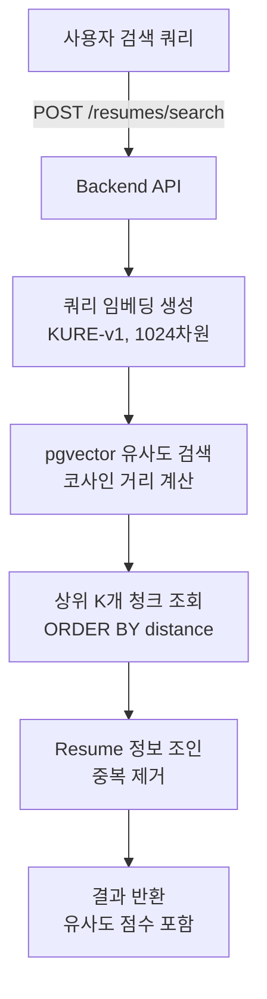

# 🔍 Phase 2: 벡터 검색 API 구현 설계서

> **작성일**: 2026-02-04
> **상태**: 📋 **설계 단계**
> **목적**: pgvector를 활용한 이력서 벡터 유사도 검색 API 구현

---

## 📊 Phase 2 개요

### ✅ **Phase 1 완료 사항 (전제 조건)**

- ✅ PDF 업로드 및 텍스트 추출
- ✅ LangChain 청킹 (chunk_size=1500, overlap=300)
- ✅ KURE-v1 임베딩 생성 (1024차원)
- ✅ ResumeChunk 테이블에 임베딩 저장

### 🎯 **Phase 2 목표**

1. **벡터 유사도 검색 API** - 쿼리로 관련 이력서 찾기
2. **이력서 상세 검색** - 특정 섹션(경력, 프로젝트 등) 검색
3. **유사 이력서 추천** - 특정 이력서와 유사한 다른 이력서 찾기

---

## 🏗️ 아키텍처 설계

### **검색 플로우**



---

## 📝 구현 상세

### **1. 벡터 검색 API**

#### **1-1. 기본 검색 엔드포인트**

**파일**: `backend-core/main.py`

**위치**: 기존 `/resumes` 엔드포인트 다음 (약 580줄 이후)

```python
from sqlalchemy import text
from typing import List, Optional

@app.post("/resumes/search")
async def search_resumes(
    query: str,
    top_k: int = 10,
    min_score: float = 0.5,
    db: Session = Depends(get_session),
    current_user: User = Depends(get_current_user)
):
    """
    벡터 유사도 기반 이력서 검색
  
    Args:
        query: 검색 쿼리 (예: "Python 백엔드 개발자")
        top_k: 반환할 최대 결과 수 (기본: 10)
        min_score: 최소 유사도 점수 (0~1, 기본: 0.5)
      
    Returns:
        검색 결과 리스트 (유사도 순 정렬)
    """
    logger.info(f"🔍 Resume search: query='{query}', top_k={top_k}, user={current_user.id}")
  
    # 1. 쿼리를 임베딩으로 변환
    # Celery task로 전송하거나 직접 호출
    # 여기서는 간단히 직접 호출 (동기)
    from ai_worker.utils.vector_utils import get_embedding_generator
  
    generator = get_embedding_generator()
    query_embedding = generator.encode_query(query)  # 1024차원 벡터
  
    # 2. pgvector로 유사도 검색
    # <=> 연산자: 코사인 거리 (0에 가까울수록 유사)
    # 1 - 코사인 거리 = 코사인 유사도
    sql_query = text("""
        SELECT 
            rc.id as chunk_id,
            rc.resume_id,
            rc.content,
            rc.chunk_index,
            1 - (rc.embedding <=> :query_embedding) as similarity_score,
            r.file_name,
            r.candidate_id,
            u.full_name as candidate_name,
            u.email as candidate_email
        FROM resume_chunks rc
        JOIN resumes r ON rc.resume_id = r.id
        JOIN users u ON r.candidate_id = u.id
        WHERE 
            r.processing_status = 'completed'
            AND rc.embedding IS NOT NULL
            AND 1 - (rc.embedding <=> :query_embedding) >= :min_score
        ORDER BY rc.embedding <=> :query_embedding
        LIMIT :top_k
    """)
  
    result = db.execute(
        sql_query,
        {
            "query_embedding": query_embedding,
            "min_score": min_score,
            "top_k": top_k
        }
    )
  
    # 3. 결과 포맷팅
    chunks = result.fetchall()
  
    # 4. Resume별로 그룹화 (중복 제거)
    resume_map = {}
    for chunk in chunks:
        resume_id = chunk.resume_id
      
        if resume_id not in resume_map:
            resume_map[resume_id] = {
                "resume_id": resume_id,
                "file_name": chunk.file_name,
                "candidate_name": chunk.candidate_name,
                "candidate_email": chunk.candidate_email,
                "max_similarity": chunk.similarity_score,
                "matched_chunks": []
            }
      
        resume_map[resume_id]["matched_chunks"].append({
            "chunk_index": chunk.chunk_index,
            "content": chunk.content[:200] + "..." if len(chunk.content) > 200 else chunk.content,
            "similarity_score": float(chunk.similarity_score)
        })
      
        # 최고 유사도 업데이트
        if chunk.similarity_score > resume_map[resume_id]["max_similarity"]:
            resume_map[resume_id]["max_similarity"] = chunk.similarity_score
  
    # 5. 유사도 순으로 정렬
    results = sorted(
        resume_map.values(),
        key=lambda x: x["max_similarity"],
        reverse=True
    )
  
    logger.info(f"✅ Found {len(results)} resumes matching query")
  
    return {
        "query": query,
        "total_results": len(results),
        "results": results
    }
```

**응답 예시**:

```json
{
  "query": "Python 백엔드 개발자",
  "total_results": 3,
  "results": [
    {
      "resume_id": 10,
      "file_name": "이력서.pdf",
      "candidate_name": "김지원",
      "candidate_email": "no_reply@example.com",
      "max_similarity": 0.87,
      "matched_chunks": [
        {
          "chunk_index": 0,
          "content": "Python, FastAPI, PostgreSQL을 사용한 백엔드 개발 경험...",
          "similarity_score": 0.87
        }
      ]
    }
  ]
}
```

---

#### **1-2. 임베딩 생성 헬퍼 함수**

**문제**: Backend에서 직접 임베딩 모델을 로드하면 메모리 낭비

**해결**: 두 가지 옵션

##### **옵션 A: Celery Task 사용 (추천)**

**파일**: `ai-worker/tasks/search_helper.py` (신규 생성)

```python
"""
검색 헬퍼 Task
"""
from celery import shared_task
from utils.vector_utils import get_embedding_generator
import logging

logger = logging.getLogger("SearchHelper")

@shared_task(bind=True, name="generate_query_embedding")
def generate_query_embedding_task(self, query: str):
    """
    검색 쿼리를 임베딩으로 변환
  
    Args:
        query: 검색 쿼리
      
    Returns:
        list: 1024차원 임베딩 벡터
    """
    logger.info(f"🔍 Generating embedding for query: {query}")
  
    generator = get_embedding_generator()
    embedding = generator.encode_query(query)
  
    return embedding.tolist()
```

**Backend에서 호출**:

```python
# backend-core/main.py
@app.post("/resumes/search")
async def search_resumes(query: str, ...):
    # Celery task로 임베딩 생성
    task = celery_app.send_task(
        "generate_query_embedding",
        args=[query]
    )
  
    # 결과 대기 (동기)
    query_embedding = task.get(timeout=10)  # 최대 10초 대기
  
    # 이후 검색 로직...
```

##### **옵션 B: Backend에 경량 임베딩 서비스 추가**

**파일**: `backend-core/utils/embedding_client.py` (신규 생성)

```python
"""
임베딩 생성 클라이언트 (ai-worker와 통신)
"""
import httpx
import logging

logger = logging.getLogger("EmbeddingClient")

class EmbeddingClient:
    """ai-worker의 임베딩 서비스와 통신"""
  
    def __init__(self, worker_url: str = "http://ai-worker:8080"):
        self.worker_url = worker_url
        self.client = httpx.AsyncClient(timeout=30.0)
  
    async def encode_query(self, text: str) -> list:
        """
        쿼리를 임베딩으로 변환
      
        Args:
            text: 검색 쿼리
          
        Returns:
            list: 1024차원 벡터
        """
        try:
            response = await self.client.post(
                f"{self.worker_url}/embed",
                json={"text": text, "type": "query"}
            )
            response.raise_for_status()
            return response.json()["embedding"]
        except Exception as e:
            logger.error(f"Failed to generate embedding: {e}")
            raise
```

**ai-worker에 HTTP 서버 추가**:

```python
# ai-worker/embedding_server.py (신규 생성)
from flask import Flask, request, jsonify
from utils.vector_utils import get_embedding_generator

app = Flask(__name__)
generator = get_embedding_generator()

@app.post("/embed")
def embed_text():
    """텍스트를 임베딩으로 변환"""
    data = request.json
    text = data.get("text")
    embed_type = data.get("type", "passage")  # query or passage
  
    if embed_type == "query":
        embedding = generator.encode_query(text)
    else:
        embedding = generator.encode_passage(text)
  
    return jsonify({"embedding": embedding.tolist()})

if __name__ == "__main__":
    app.run(host="0.0.0.0", port=8080)
```

---

### **2. 유사 이력서 추천 API**

**파일**: `backend-core/main.py`

```python
@app.get("/resumes/{resume_id}/similar")
async def find_similar_resumes(
    resume_id: int,
    top_k: int = 5,
    db: Session = Depends(get_session),
    current_user: User = Depends(get_current_user)
):
    """
    특정 이력서와 유사한 다른 이력서 찾기
  
    Args:
        resume_id: 기준 이력서 ID
        top_k: 반환할 유사 이력서 수
      
    Returns:
        유사한 이력서 리스트
    """
    # 1. 기준 이력서 조회
    resume = db.get(Resume, resume_id)
    if not resume:
        raise HTTPException(status_code=404, detail="Resume not found")
  
    # 2. 기준 이력서의 첫 번째 청크 임베딩 가져오기
    stmt = select(ResumeChunk).where(
        ResumeChunk.resume_id == resume_id,
        ResumeChunk.chunk_index == 0
    )
    base_chunk = db.exec(stmt).first()
  
    if not base_chunk or base_chunk.embedding is None:
        raise HTTPException(
            status_code=400,
            detail="Resume embedding not available"
        )
  
    # 3. 유사한 청크 검색 (자기 자신 제외)
    sql_query = text("""
        SELECT DISTINCT
            r.id as resume_id,
            r.file_name,
            r.candidate_id,
            u.full_name as candidate_name,
            1 - (rc.embedding <=> :base_embedding) as similarity_score
        FROM resume_chunks rc
        JOIN resumes r ON rc.resume_id = r.id
        JOIN users u ON r.candidate_id = u.id
        WHERE 
            r.id != :resume_id
            AND r.processing_status = 'completed'
            AND rc.embedding IS NOT NULL
        ORDER BY rc.embedding <=> :base_embedding
        LIMIT :top_k
    """)
  
    result = db.execute(
        sql_query,
        {
            "base_embedding": base_chunk.embedding,
            "resume_id": resume_id,
            "top_k": top_k
        }
    )
  
    similar_resumes = [
        {
            "resume_id": row.resume_id,
            "file_name": row.file_name,
            "candidate_name": row.candidate_name,
            "similarity_score": float(row.similarity_score)
        }
        for row in result.fetchall()
    ]
  
    return {
        "base_resume_id": resume_id,
        "base_file_name": resume.file_name,
        "similar_resumes": similar_resumes
    }
```

---

### **3. 고급 검색 필터**

**파일**: `backend-core/main.py`

```python
from pydantic import BaseModel
from typing import Optional

class ResumeSearchRequest(BaseModel):
    """이력서 검색 요청"""
    query: str
    top_k: int = 10
    min_score: float = 0.5
  
    # 필터 옵션
    skills: Optional[List[str]] = None  # 예: ["Python", "FastAPI"]
    min_experience_years: Optional[int] = None
    education_level: Optional[str] = None  # 예: "학사", "석사"

@app.post("/resumes/search/advanced")
async def advanced_search_resumes(
    request: ResumeSearchRequest,
    db: Session = Depends(get_session),
    current_user: User = Depends(get_current_user)
):
    """
    고급 필터를 포함한 이력서 검색
  
    - 벡터 유사도 검색
    - structured_data 기반 필터링
    """
    # 1. 기본 벡터 검색 (위와 동일)
    # ...
  
    # 2. structured_data 필터 적용
    if request.skills:
        # JSON 필드 쿼리
        sql_query += """
            AND r.structured_data->'skills'->'programming_languages' ?| :skills
        """
  
    # 3. 결과 반환
    # ...
```

---

## 🔧 필요한 수정 사항

### **1. vector_utils.py 수정**

**파일**: `ai-worker/utils/vector_utils.py`

**추가 메서드**:

```python
class EmbeddingGenerator:
    # 기존 코드...
  
    def encode_query(self, text: str) -> np.ndarray:
        """
        검색 쿼리를 임베딩으로 변환
      
        Note: KURE-v1은 query와 passage를 구분하지 않으므로
              encode_passage와 동일하게 처리
      
        Args:
            text: 검색 쿼리
          
        Returns:
            np.ndarray: 1024차원 벡터
        """
        return self.encode_passage(text)
```

---

### **2. main.py에 Celery 설정 추가**

**파일**: `ai-worker/main.py`

```python
# 기존 include에 추가
app = Celery(
    "ai_worker",
    broker="redis://redis:6379/0",
    backend="redis://redis:6379/0",
    include=[
        'tasks.evaluator',
        'tasks.vision',
        'tasks.question_generator',
        'tasks.resume_parser',
        'tasks.answer_collector',
        'tasks.search_helper'  # ✅ 추가
    ]
)
```

---

### **3. PostgreSQL 인덱스 생성**

**파일**: `infra/postgres/init.sql`

**추가 내용**:

```sql
-- 벡터 검색 성능 향상을 위한 인덱스
-- HNSW (Hierarchical Navigable Small World) 인덱스
CREATE INDEX IF NOT EXISTS idx_resume_chunks_embedding 
ON resume_chunks 
USING hnsw (embedding vector_cosine_ops)
WITH (m = 16, ef_construction = 64);

-- 일반 인덱스
CREATE INDEX IF NOT EXISTS idx_resumes_status 
ON resumes(processing_status);

CREATE INDEX IF NOT EXISTS idx_resume_chunks_resume_id 
ON resume_chunks(resume_id);
```

**인덱스 설명**:

- `hnsw`: 고속 근사 최근접 이웃 검색
- `m = 16`: 그래프 연결 수 (높을수록 정확하지만 느림)
- `ef_construction = 64`: 인덱스 구축 시 탐색 깊이

---

## 📊 성능 최적화

### **1. 인덱스 전략**

```sql
-- 벡터 인덱스 타입 비교
-- IVFFlat: 빠르지만 덜 정확
CREATE INDEX idx_embedding_ivfflat 
ON resume_chunks 
USING ivfflat (embedding vector_cosine_ops)
WITH (lists = 100);

-- HNSW: 느리지만 더 정확 (추천)
CREATE INDEX idx_embedding_hnsw 
ON resume_chunks 
USING hnsw (embedding vector_cosine_ops)
WITH (m = 16, ef_construction = 64);
```

### **2. 쿼리 최적화**

```python
# 캐싱 전략
from functools import lru_cache

@lru_cache(maxsize=100)
def get_cached_embedding(query: str) -> list:
    """자주 사용되는 쿼리는 캐싱"""
    generator = get_embedding_generator()
    return generator.encode_query(query).tolist()
```

### **3. 배치 검색**

```python
@app.post("/resumes/search/batch")
async def batch_search_resumes(
    queries: List[str],
    top_k: int = 10,
    db: Session = Depends(get_session)
):
    """
    여러 쿼리를 한 번에 검색
    - 임베딩 생성을 배치로 처리
    - DB 쿼리 최적화
    """
    # 모든 쿼리를 한 번에 임베딩
    generator = get_embedding_generator()
    embeddings = [generator.encode_query(q) for q in queries]
  
    # 병렬 검색
    results = []
    for query, embedding in zip(queries, embeddings):
        # 검색 로직...
        pass
  
    return results
```

---

## 🧪 테스트 시나리오

### **테스트 1: 기본 검색**

```bash
curl -X POST "http://localhost:8000/resumes/search" \
  -H "Content-Type: application/json" \
  -H "Authorization: Bearer $TOKEN" \
  -d '{
    "query": "Python 백엔드 개발자",
    "top_k": 5,
    "min_score": 0.6
  }'
```

**기대 결과**:

- 200 OK
- Python 관련 이력서 반환
- 유사도 점수 0.6 이상

---

### **테스트 2: 유사 이력서 추천**

```bash
curl -X GET "http://localhost:8000/resumes/10/similar?top_k=3" \
  -H "Authorization: Bearer $TOKEN"
```

**기대 결과**:

- 200 OK
- resume_id=10과 유사한 3개 이력서 반환

---

### **테스트 3: 성능 테스트**

```python
import time

# 100개 쿼리 검색 시간 측정
queries = [f"Python 개발자 {i}" for i in range(100)]

start = time.time()
for query in queries:
    response = requests.post(
        "http://localhost:8000/resumes/search",
        json={"query": query, "top_k": 10}
    )
end = time.time()

print(f"평균 검색 시간: {(end - start) / 100:.3f}초")
```

**목표**:

- 평균 검색 시간 < 0.5초
- 인덱스 사용 시 < 0.1초

---

## 📦 필요한 패키지

### **backend-core/requirements.txt**

```txt
# 기존 패키지...

# 벡터 검색 (이미 포함됨)
pgvector>=0.2.0
```

### **ai-worker/requirements.txt**

```txt
# 기존 패키지...

# HTTP 서버 (옵션 B 선택 시)
flask>=3.0.0
flask-cors>=4.0.0
```

---

## 🔄 구현 순서

### **Step 1: 인덱스 생성**

1. `infra/postgres/init.sql` 수정
2. PostgreSQL 재시작 또는 수동 인덱스 생성
3. 인덱스 생성 확인

### **Step 2: 검색 헬퍼 구현**

4. `ai-worker/tasks/search_helper.py` 생성
5. `ai-worker/main.py`에 task 등록
6. Worker 재시작

### **Step 3: 검색 API 구현**

7. `backend-core/main.py`에 `/resumes/search` 추가
8. Backend 재시작
9. Swagger UI에서 테스트

### **Step 4: 고급 기능 추가**

10. 유사 이력서 추천 API
11. 고급 필터 검색 API
12. 배치 검색 API (선택)

### **Step 5: 성능 최적화**

13. 쿼리 캐싱 추가
14. 인덱스 튜닝
15. 부하 테스트

---

## ✅ 완료 체크리스트

### **필수 기능**

- [ ] PostgreSQL HNSW 인덱스 생성
- [ ] 쿼리 임베딩 생성 Task
- [ ] 기본 벡터 검색 API (`/resumes/search`)
- [ ] 유사 이력서 추천 API (`/resumes/{id}/similar`)
- [ ] 검색 결과 포맷팅 (중복 제거, 정렬)

### **선택 기능**

- [ ] 고급 필터 검색
- [ ] 배치 검색
- [ ] 쿼리 캐싱
- [ ] 검색 히스토리 저장

### **테스트**

- [ ] 단일 쿼리 검색 테스트
- [ ] 유사 이력서 추천 테스트
- [ ] 성능 테스트 (응답 시간 < 0.5초)
- [ ] 정확도 테스트 (관련 이력서 반환)

---

## 🎯 기대 효과

1. **빠른 검색**

   - pgvector + HNSW 인덱스로 밀리초 단위 검색
   - 수천 개 이력서에서도 즉시 결과 반환
2. **정확한 매칭**

   - KURE-v1 한국어 임베딩으로 의미 기반 검색
   - 키워드 매칭보다 훨씬 정확
3. **확장 가능**

   - 이력서-질문 매칭
   - 이력서-JD 매칭
   - 유사 지원자 그룹화
4. **사용자 경험**

   - 자연어 쿼리 지원 ("3년 이상 Python 경험")
   - 실시간 검색 결과
   - 관련도 점수 제공

---

## 📚 참고 자료

- [pgvector Documentation](https://github.com/pgvector/pgvector)
- [HNSW Algorithm](https://arxiv.org/abs/1603.09320)
- [KURE-v1 Model](https://huggingface.co/nlpai-lab/KURE-v1)
- [FastAPI Background Tasks](https://fastapi.tiangolo.com/tutorial/background-tasks/)

---

**작성자**: AI Assistant
**최종 수정**: 2026-02-04
**상태**: 📋 설계 완료, 구현 대기
