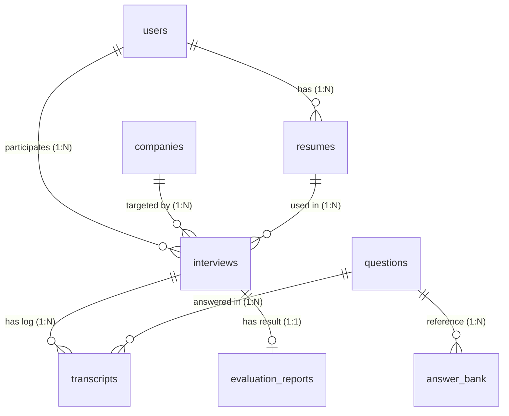
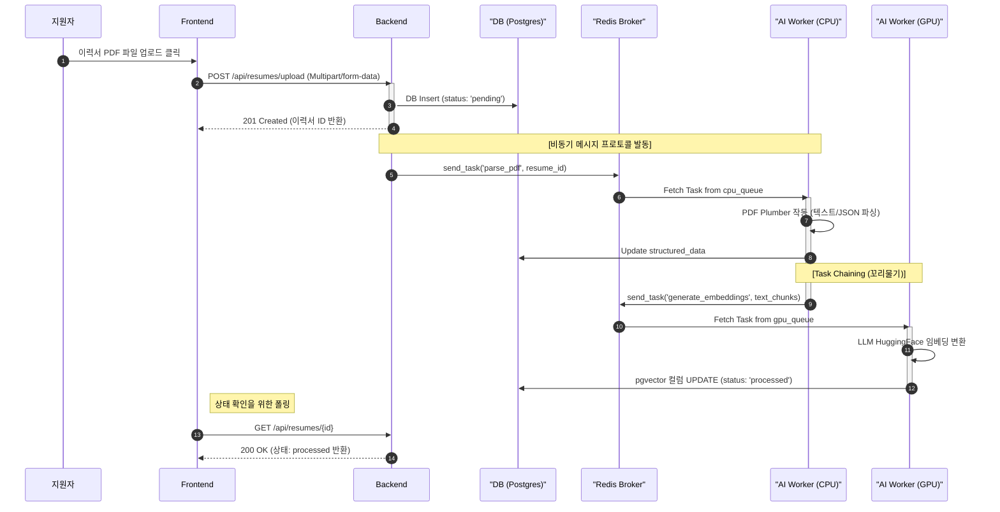
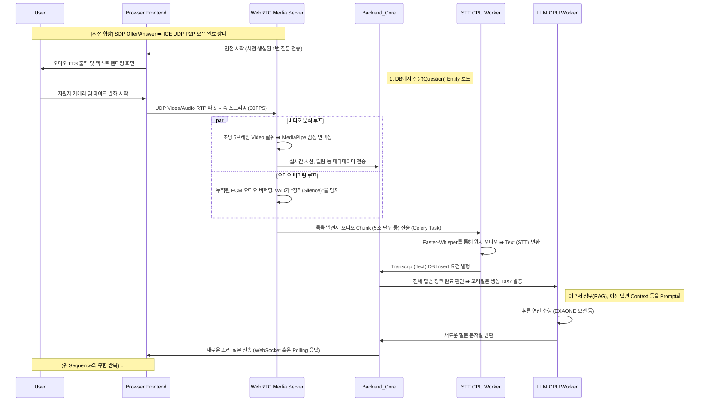

# Big20 AI 면접 프로젝트 - 시스템 아키텍처 디자인(SAD) 명세서

**문서 버전**: 1.4.0 
**작성 목적**: 시스템 전체의 아키텍처를 심도 있는 수준으로 명세하여, 개발부터 운영, AI 모델 연동 및 데이터베이스 설계까지 완벽한 기술적 가이드를 제공합니다. 특히 컴포넌트 간의 정적 구조(Static Structure)와 런타임 상의 동적 구조(Dynamic Structure), 그리고 데이터베이스 ERD와 핵심 시스템 워크플로우(Workflow)를 상세 분해하여 기술합니다.

---

## 1. 개요 (Introduction)

### 1.1 문서의 목적

본 문서(System Architecture Design, SAD)는 Big20 AI 면접 시스템이 안정적으로 기능하기 위한 소프트웨어 생태계 전반의 기술적 골격, 구조적 경계, 그리고 컴포넌트 간 상호작용의 원칙을 확립하기 위해 작성되었습니다. 코드 구현 세부 수준(Code-level implement)을 넘어선 시스템의 생명력을 불어넣는 뼈대를 상세하게 정의함으로써, 인프라 엔지니어, 데이터 엔지니어, AI 모델러, 그리고 백엔드/프론트엔드 개발자 모두가 참조할 수 있는 마스터플랜(Master Plan)으로 기능합니다.

### 1.2 시스템 범위 및 서비스 개요

Big20 AI 면접 시스템은 최신 대규모언어모델(LLM), 음성인식(STT) 및 합성(TTS), 그리고 시각 컴퓨팅(Vision AI) 기술을 WebRTC라는 초저지연 미디어 스트리밍 프로토콜 위에서 조화롭게 융합한 차세대 면접 플랫폼입니다.

- **RAG 기반 지식 확장**: 지원자의 이력서, 채용 공고의 직무요건 구조화 후 벡터 서치.
- **실시간 상호작용**: AI 면접관과 지원자 간의 지연 없는 영상 대화 및 꼬리물기 질문.
- **다차원 평가 모델**: 텍스트(논리력, 직무적합성) 뿐만 아니라 음성(자신감), 시각(표정, 시선 처리) 데이터를 앙상블 조합하여 세밀한 리포트 제공.

### 1.3 용어 사전 (Glossary)

- **RAG (Retrieval-Augmented Generation)**: 외부 지식 베이스(이력서 등)를 검색하여 LLM의 프롬프트에 제공함으로써 환각 증세를 줄이는 기법.
- **WebRTC (Web Real-Time Communication)**: 브라우저 간 플러그인 없이 오디오, 비디오, 데이터를 실시간으로 교환할 수 있게 해주는 기술.
- **Celery**: 분산 메시지 패싱 기반의 비동기 작업 큐/작업자 시스템.
- **pgvector**: PostgreSQL의 확장 모듈로 다차원 벡터의 저장 및 유사도 검색 알고리즘(HNSW, IVFFlat)을 지원.
- **SDP (Session Description Protocol)**: WebRTC에서 미디어 해상도, 코덱, 암호화 방식 등을 협상하기 위한 프로토콜.
- **ICE (Interactive Connectivity Establishment)**: 방화벽이나 NAT 환경을 뚫고 P2P 통신을 가능하게 하는 네트워크 라우팅 기술.

### 1.4 아키텍처 목표 및 제약사항

1. **극단적 비동기화 및 결합성 최소화 (Loose Coupling & Asynchronous)**: 고해상도 비전 분석이나 LLM 추론과 같은 연산 병목 작업을 Backend Core 프로세스 밖으로 분리(Celery 기반)하여, 어플리케이션이 Request 폭주 시 멈추지 않아야 합니다.
2. **GPU / CPU 워크로드 격리 (Workload Isolation)**: LLM/임베딩 생성 등 VRAM을 과도하게 점유하는 Task 체인과, 단순 CPU 병렬화로 처리가능한 파싱/STT/TTS Task 체인을 분리한 Dual-Worker 시스템 강제.
3. **환경 이식성 극대화 (Portability)**: 모든 워크스테이션 인프라는 로컬, Cloud(AWS, GCP), 온프레미스 등에 구애받지 않도록 단일 `docker-compose.yml` 컨테이너 스웜(Swarm)으로 응집.

---

## 2. 인프라 아키텍처 (Infrastructure Architecture)

### 2.1 서버 구성 및 네트워크 토폴로지

전체 시스템은 Docker Compose를 이용한 단일 호스트 인스턴스(혹은 멀티 호스트 클러스터) 상의 가상 브릿지 네트워크(`interview_network`)로 구성됩니다. 외부 인터넷과 접촉하는 계층과 철저히 내부망에서만 동작하는 계층으로 분리하여 보안 격리(DMZ 개념)를 달성합니다.

### 2.2 컨테이너 토포그래피 (Container Topography)

1. **`interview_db` (Postgres + pgvector)**: 데이터 영속성 계층.
2. **`interview_redis` (Redis 7-alpine)**: 인메모리 데이터스토어. Celery의 메시지 브로커 및 JWT 리프레시 토큰 유지, WebRTC 연결 세션 관리 기능 수행.
3. **`interview_backend` (FastAPI Core)**: 애플리케이션 REST API 허브. 프론트엔드의 모든 HTTP 요청을 처리.
4. **`interview_media` (aiortc 기반 WebRTC)**: 고대역폭 스트림 처리를 전담. STUN/TURN 서버에 의존하지 않고 로컬 브릿지에서 Media Track 릴레이.
5. **`interview_worker_gpu` (Celery + PyTorch)**: 대규모 텐서 연산. 모델 웨이트 캐싱과 추론 속도가 필수이며 VRAM 제약을 관리.
6. **`interview_worker_cpu` (Celery + Python)**: 무거운 I/O 및 분산 연산. PDF 파싱 및 오디오 파일 로드 등 멀티 코어 CPU를 효율적으로 활용.

### 2.3 포트 설계 및 내부 통신 규약

- **Public DMZ Zone (외부 노출)**:
  - `Frontend (React)`: 3000 (HTTP)
  - `Backend-Core`: 8000 (HTTP/REST)
  - `Media-Server`: 8080 (WebSocket Signaling), 50000-50050/UDP (RTP Media Packet Transport)
- **Private Trust Zone (외부 접속 전면 차단)**:
  - `PostgreSQL`: 5432 / 로컬 호스트 바인딩 15432
  - `Redis`: 6379

---

## 3. 애플리케이션 정적 구조 (Static Structure)

정적 구조란 시스템을 이루는 클래스, 컴포넌트, 모듈 들이 컴파일 타임 및 배포 타임 조직적으로 어떻게 구성되어 있는지를 나타냅니다. 기능별 강한 응집력과 모듈 간 느슨한 결합을 원칙으로 합니다.

### 3.1 전체 시스템 컴포넌트 뷰 (C4 Model - Level 2 Container)

시스템은 4대 논리 블록으로 정적으로 분절됩니다.

1. **Frontend Module (`/frontend`)**
2. **Backend Services (`/backend-core`)**
3. **Media Streaming Services (`/media-server`)**
4. **AI Worker Node (`/ai-worker`)**

### 3.2 Frontend 모듈 정적 구조

프론트엔드는 React.js 에 기반한 SPA 구조를 지닙니다. 구조적 위계는 다음과 같습니다.

- **Pages Directory**: `LoginPage`, `InterviewBoard`, `Dashboard`, `ResumeUploader` 등 라우트 맵핑 컴포넌트.
- **Components Directory**: 작은 시각 단위 (예: `WebcamViewer`, `QuestionBadge`, `EmotionChart`).
- **Services (API) Directory**: 백엔드와 통신하는 순수 함수 모음 (`api/interview.js`, `api/auth.js`). Axios 인스턴스의 캡슐화.
- **State Management**: `Zustand` 혹은 `Context`를 이용해 애플리케이션 전역 상태(예: 로그인 세션, 진행 중인 면접 문항 번호) 컴포넌트에 주입. WebRTC의 `RTCPeerConnection` 객체는 휘발성 메모리 스토어에 싱글턴 패턴과 유사하게 적재하여 LifeCycle 전반을 관리.

### 3.3 Backend Core 정적 구조

FastAPI 프레임워크 기반의 API 게이트웨이 및 코어 비즈니스 처리 엔진입니다. 계층형 아키텍처(Layered Architecture)를 준수합니다.

- **Router Layer (`/routes`)**:
  - 엔드포인트 도메인별 분리: `auth`, `users`, `resumes`, `interviews`, `transcripts`
  - 각 모듈은 `APIRouter` 인스턴스 소유. 의존성 주입(`Produces`/`Depends`)을 통해 HTTP Header 검증과 DB Session 연결.
- **Service & Task delegation Layer**:
  - `celery_app.py`: Redis와의 연결 브릿지를 초기화하고 비동기 워커로의 메시지 직렬화 전송(`send_task`)을 선언.
- **Data Access Layer (`db_models.py`, `database.py`)**:
  - SQLModel (SQLAlchemy 프록시 래퍼) 기반 ORM 매핑.
  - 정적 클래스 테이블 매핑 모델들: `User`, `Resume`, `Interview`, `Transcript`, `Question`.
- **Utils Layer (`/utils`)**: JWT Tokenizer, Hashing, Timezone formatter 등 비즈니스 로직과 무관한 유틸리티.

### 3.4 Media Server 정적 구조

- **Signaling Handler**: `/ws/signaling` 엔드포인트. FastAPI WebSocket 으로 연결.
- **WebRTC Core (`aiortc`)**:
  - `RTCPeerConnection`: 커넥션 본체 관리.
  - `FaceTrack (MediaStreamTrack)`: 비디오 스트림 상속 클래스. `recv()` 오버라이딩을 통해 프레임 후킹.
  - `AudioBufferTrack`: 오디오 스트림 상속 클래스. PCM 데이터를 `.wav` 형태의 메모리 버퍼로 캐치.
- **Vision Pipeline (`/vision`)**: MediaPipe Holistic 인스턴스를 소유한 정적 추론 클래스.

### 3.5 AI Worker 정적 구조

비동기 작업 셀들의 집합체입니다.

- **Tasks Definition (`/tasks`)**: `evaluator.py`, `stt.py`, `resume_parser.py`, `question_generator.py`.
  - 각 파일 안에는 `@app.task` 또는 `@shared_task` 로 데코레이팅 된 고립된 원격 절차 호출(RPC)용 순수 함수가 존재.
- **Configuration & App**: `main.py` 중심의 Celery App 객체. 정적 라우팅 테이블(`task_routes`) 선언으로 특정 함수명을 무조건 `gpu_queue` 혹은 `cpu_queue`로 하드코딩 매핑.

---

## 4. 데이터 아키텍처 및 ERD 구조 (Data Architecture & ERD)

데이터 레이어는 단순 관계형 저장을 뛰어넘어, RAG 검색 연산을 원스톱으로 지원하기 위한 명확한 스키마 결합을 요구합니다. PostgreSQL 과 pgvector 를 단일 Data Source 로 운용합니다.

### 4.1 논리적 데이터 모델 (Logical Data Model ERD)

### 4.2 주요 엔티티 및 스키마 명세

| 엔티티 (Table) | 주요 컬럼 (Columns) | 타입 (Type) | 물리적 역할 설명 |
| :--- | :--- | :--- | :--- |
| **users** | `id` (PK) `email` `role` | int string string | 사용자 식별 (candidate, admin 등) |
| **companies** | `id` (PK) `ideal` `embedding` | string string vector(1024) | 고유 ID(문자열), 회사의 인재상 및 임베딩 벡터값 보유 |
| **resumes** | `id` (PK) `structured_data` `embedding` | int jsonb vector(1024) | 이력서 파싱 JSON 결과 및 전문 벡터 데이터 |
| **interviews** | `id` (PK) `status` `emotion_summary` | int string jsonb | 면접 상태 (LIVE, COMPLETED 등) 및 전체 세션 감정 요약 |
| **questions** | `id` (PK) `rubric_json` `embedding` | int jsonb vector(1024) | 출제 질문의 평가 지표(json) 및 벡터값 |
| **transcripts** | `id` (PK) `speaker` `emotion` | int string jsonb | 유저 및 AI 발화 기록 STT, 프레임별 감정 메타데이터 |
| **evaluation_reports** | `id` (PK) `technical_score` `details_json` | int float jsonb | 최종 면접 점수 및 세부 LLM 리포팅 정보 |
| **answer_bank** | `id` (PK) `answer_text` `embedding` | int string vector(1024) | 질문별 모범 답변 내용 텍스트 및 임베딩 벡터 |

### 4.3 주요 데이터 설계 및 인덱스 전략

- **`vector` 타입 컬럼**: 이력서(`resume`), 질문(`question`), 회사(`company`), 모범답안(`answer_bank`)의 `embedding` 컬러에 사용(1024차원). pgvector 엑스텐션을 켰을 때, `L2 distance` 혹은 `Cosine Similarity` 인덱스를 걸어 RAG 인접 항목 조회가 가능토록 보장합니다.
- **`jsonb` 타입 컬럼**: 각 인터뷰의 감정 요약(`emotion_summary`), 트랜스크립트 프레임 단위 감정(`emotion`), 질문 평가 지표(`rubric_json`)를 동적으로 저장합니다. 별도 테이블 조인을 없애 성능을 극대화했습니다.
- **인덱스(Index) 전략**: 쿼리 레이턴시 방지를 위해 FK 컬럼(`candidate_id`, `interview_id`), 유저 검색용(`email`, `username`)에 B-Tree 인덱스를 구축합니다.

---

## 5. 시스템 동적 워크플로우 (Dynamic System Workflows)

동적 구조는 시스템이 실행(Runtime) 중일 때 시간의 흐름에 따라 이벤트가 어떻게 발행/전달되는지를 파악하는 흐름도입니다. 크게 **오프보딩 파이프라인(이력서 DB화)** 과 **실시간 면접 제어 워크플로우** 로 분리됩니다.

### 5.1 회원 가입 및 이력서 처리 파이프라인 (Onboarding Workflow)

사용자가 회원가입 후 이력서를 등록하면 뒷단에서 LLM RAG용 인덱싱을 구축하는 단계적 워크플로우.

### 5.2 지능형 면접 통신 사이클 (The Interview Ping-Pong Dynamics)

이 시스템의 가장 복잡한 동적 메커니즘이자 시스템의 정체성을 규정하는 **핵심 WebRTC 스트리밍 및 다중 AI 추론 핑퐁 사이클입니다.** 데이터가 핑(면접관 질문)과 퐁(지원자 답변)을 반복하며 AI 모델을 기계 톱니바퀴처럼 순환시킵니다.

### 5.3 세션 종료 시나리오 (Assessment Evaluation Workflow)

1. 질문 목표치(예: 8문항) 달성 또는 유저 측 버튼 클릭으로 세션 `completed` 상태 처리.
2. `tasks.evaluator.generate_final_report` 셀러리 태스크가 스케줄러를 통해 활성화.
3. **AI Worker GPU** 는 해당 세션의 전체 Transcript 히스토리, Vision 데이터(응시 이탈 횟수, 긍부정 감정 퍼센티지 분포), 지원 기업 Job Describe 참조를 통합 로드.
4. LLM이 심층 평가 프롬프트를 바탕으로 강점, 약점, 직무 지식도, 추가 스펙 추천 등의 구조화된 JSON 리포트 회신.
5. 분석 결과를 DB에 영구 귀속 및 이벤트 푸시로 프론트 최종결과 대시보드 통보.

---

## 6. AI 모델 연결 및 프롬프트 아키텍처 (AI Model Architecture)

AI 모델 층은 시스템의 '두뇌' 역할을 하며, 각 역할에 맞는 파운데이션 모델을 매핑합니다.

### 6.1 음성 인식 (STT) 모듈 구조

- **Model**: `Whisper-large-v3-turbo` 또는 `faster-whisper`. CPU 의존적 연산 최적화를 위해 C++ 기반 CTranslate2 백엔드로 구동.
- **Connection**: REST API 호출의 동기 방식을 지양. Audio Blob 데이터 자체를 워커 내부의 큐로 직렬화하거나 혹은 공유 마운트 디렉토리를 참조하여 모델 엔진이 변환을 전개.

### 6.2 대형 언어 및 인지 모델 (LLM) 구조

- **Model**: `EXAONE-3.0-7.8B-Instruct` (또는 Llama 계열 최신 Instruct 기반 모델).
- **GPU Deployment**: 1장의 최신 VRAM(GPU) 에 풀 로드, 혹은 Quantization 하여 캐싱 로드. LangChain 프레임워크 래핑을 거쳐 RAG의 Vector Store Retriever 체인 구축 완료 후, `invoke()` 메서드 사용.
- **Context Injection Policy**: 모델이 할루시네이션(환각)을 일으키지 않도록, 다음과 같은 프롬프트 시스템 아키텍처를 도입.
  - [System Context]: 회사 인재상 객체 주입
  - [Background]: 파싱된 이력서의 특정 Experience 단락 주입
  - [History]: 지나간 질문과 유저 발화 최근 N개 주입
  - => 위 Context 조각들을 융합해 최적의 문장 생성.

### 6.3 시각 지능 모듈 (Vision AI)

- **Model**: Google MediaPipe (Face Mesh, Pose Landmark), OpenCV (Head pose estimation).
- **Arch**: 딥러닝 무거운 텐서 추론을 최소화하고 CPU 호환의 C++ 빌드 파이프라인인 MediaPipe를 활용. 프레임 내 468개 랜드마크 추출 후, 눈 깜빡임 각도 비율(EAR), 입꼬리 등비 연산을 통해 기쁨, 당황, 침착 등의 7가지 감정 인덱싱 획득.

---

## 7. 보안 관리 전략 (Security & Compliance)

### 7.1 통신 암호화 및 무결성

유저 발화 영상과 음성은 완전히 종단 간 암호화(WebRTC DTLS/SRTP 규격)되어 Media서버로 전송. 중간자 열람 불가. 시스템이 외부에 공개될 경우 Nginx Reverse Proxy 를 리버스 게이트웨이로 두어 SSL(TLS 1.2+) 종료(Termination) 수행.

### 7.2 인증(Auth) 및 인가 메커니즘

- **Access Token**: JWT (JSON Web Token) 기법을 사용 (HMAC-SHA256 해시 모델). Access 토큰의 수명을 짧게 관리하고 OAuth2PasswordBearer 규격을 FastAPI에 체인 결합하여 유효하지 않은 토큰 접근시 Http 401 즉시 차단.
- **RBAC (Role Based Access Control)**: `admin` 권한은 전체 이력서 접근 허용, 일반 지원자 `candidate` 권한은 소유권 ID 비교를 거쳐 본인의 기록(`user_id == get_current_user.id`)에만 R/W 권한을 허여하는 엄격한 멀티테넌트(Multi-tenant) 모델 구현.

### 7.3 크리덴셜 및 민감 설정 관리

`.env`의 환경 변수화 규칙. 소스 코드(Git)에 절대 노출하지 않는 데이터:

- `POSTGRES_PASSWORD`, `DATABASE_URL` (DB 연결 문자열)
- `DEEPGRAM_API_KEY`, `HUGGINGFACE_HUB_TOKEN`, `LANGCHAIN_API_KEY` (서드파티 종속 인증 키워드)

---

## 8. 운영 관리 및 확장성 아키텍처 (Operational & Scalability Architecture)

### 8.1 확장 스케일업 파이프라인 (Scale-Out RoadMap)

- 현 시점 단일 컨테이너 단위 배포이나, 대용량 트래픽이 올 경우 Docker Swarm이나 Kubernetes (K8s) 전환 필요 없음 없이 `docker-compose up --scale ai-worker-cpu=4` 등의 가상 수평 확장 도입 가능성 열어두기.
- Redis 브로커 큐의 Backlog가 일정 이상 쌓일 경우 스레딩을 능동적으로 증가시키는 오토스케일링 컨셉 구상.

### 8.2 옵저버빌리티 및 인시던트 모니터링 (Observability)

- **LangSmith Tracing**: 프롬프트의 품질 저하, 예상치 못한 평가 산출, LLM 호출 병목을 추적 시각화하기 위해 LangChain Tracing V2 백엔드를 통해 실행 Tree 심층 시각화.
- **Log Formatting Strategy**: 멀티 프로세스 워커 환경에서 로그 충돌과 UTC/KST 혼선 방지를 위해 Python 로깅 Converter 최적화 적용 및 모든 로그 포맷을 `[INFO] [모듈명] 텍스트` 규칙으로 정형화.

### 8.3 장애 고립 (Fault Isolation)

Celery Worker 중 하나의 Task(예: 수십 MB 크기의 손상된 이력서 업로드 파싱 레이어)가 폭주하여 OOM (Out Of Memory)로 죽더라도, Celery의 감독 프로세스(Supervisor) 구조 상 전체 프로세서나 백엔드 로직이 죽지 않습니다. Task 실패시 Queue를 버리고 Timeout Exception 을 던지는 Fail-fast 구조 확보. DB 트랜잭션 롤백 또한 SQLModel 내 try-except 세션 Context Manager로 이중 안전 장치를 확보함.

---

## 9. 결론 및 요약

이 문서 설계에 입각하여, Big20 AI 면접 시스템 **(인프라+소프트웨어+데이터+AI+네트워크 복합 모듈)** 은 다음과 같은 아키텍처 가치를 선언합니다.

1. **내결함성(Fault tolerance)**: 외부 API(Deepgram) 실패시 내부 호스트 모델로 Fallback, GPU 모델 죽을시 재시작 자동화 구조.
2. **무중단성 보장**: WebRTC 비디오 스트림 지연 처리는 Media 서버가, 텍스트 반환은 Backend가 상호 보완적으로 협동하여 데이터 증발이 없음.
3. **영구적 유연 확장성**: 신규 AI 모델 교체가 필요하면 기존 파이프라인의 다른 코드를 수정할 필요 없이, ai-worker 내의 단일 wrapper 파일(task 함수)만 교체 가능.

이 시스템 아키텍처 디자인 명세는 프로젝트 구현 시의 흔들리지 않는 규범이 되며 향후 유지보수와 고도화를 향한 모든 엔지니어링 토대를 완벽하게 제공합니다.
