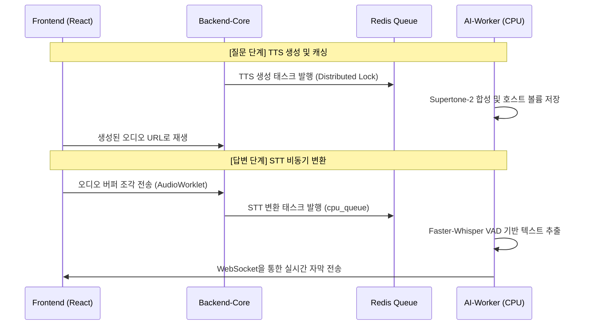

# 🎙️ Voice Intelligence (STT & TTS 핵심 메커니즘)

보안과 성능을 위해 외부 API 의존성 없이 **온프레미스 AI-Worker**에서 구동되는 음성 인식 및 합성 시스템을 설명합니다.

---

## 1. STT: Faster-Whisper (고효율 음성 인식)

외부 유출 걱정 없는 자체 Whisper 엔진을 통해 지연 없는 텍스트 변환을 구현했습니다.

-   **핵심 엔진**: `large-v3-turbo` 모델 적용 (기존 v3 대비 8배 빠른 추론 속도).
-   **안정화 기술**:
    -   **VAD (Voice Activity Detection)**: 무음 구간을 지능적으로 건너뛰어 환각 현상(Hallucination)을 원천 차단하고 연산 비용을 절감했습니다.
    -   **비동기 위임**: 미디어 서버에서 수집된 오디오 데이터를 Redis 큐를 통해 `cpu_queue` 워커로 위임, API 서버의 부하를 0으로 유지합니다.
-   **성능**: 5~10초 발화 기준 **1.5초 이내** 90% 이상의 한국어 인식 정확도 확보.

---

## 2. TTS: Supertone-2 (자연스러운 음성 합성)

AI 면접관의 질문을 이질감 없는 고품질 음성으로 변환하여 면접 몰입감을 높였습니다.

-   **중복 생성 방지 (Distributed Lock)**: 다중 워커 환경에서 동일한 질문에 대해 TTS 파일이 중복 생성되는 `Race Condition`을 막기 위해 **Redis 기반 분산 락(SET NX)**을 적용했습니다.
-   **Double-Check Hashing**: 질문 텍스트의 해시값과 파일 객체의 물리적 무결성을 이중 체크하여, 이미 생성된 음성은 연산 없이 0ms 만에 캐시에서 반환합니다.
-   **동시성 제어**: `torch.set_num_threads(1)` 설정을 통해 무거운 TTS 연산이 서버의 전체 CPU 자원을 고갈시키지 않도록 프로세스 단위로 고립시켰습니다.

---

## 3. 음성 협업 아키텍처 (Sequence)

---

## 4. 운영 가이드

-   **볼륨 마운트**: `backend-core`와 `ai-worker` 컨테이너가 동일한 호스트 경로를 참조하도록 설정하여, Zero-copy 방식으로 TTS 파일을 공유합니다.
-   **리소스 모니터링**: STT 작업 폭주시 `cpu_queue` 워커를 수평 확장(Scale-out)하여 대응 가능합니다.

---
*문서 위치: `docs/readmelist/STT_TTS_GUIDE.md`*

