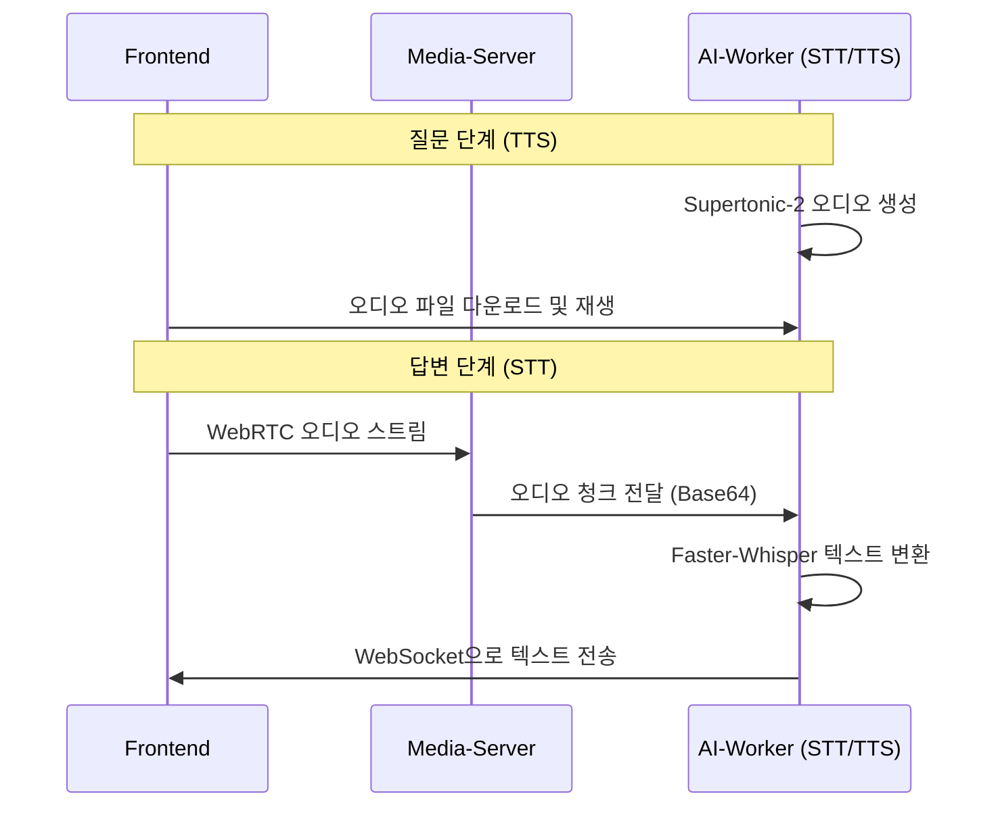

# 🎙️ Voice Intelligence (STT & TTS)

지원자의 음성을 텍스트로 변환(STT)하고, AI 면접관의 목소리를 생성(TTS)하는 음성 지능 시스템을 설명합니다.

---

## 1. STT: Faster-Whisper (자체 구동)

본 프로젝트는 보안과 비용 절감을 위해 외부 클라우드 API 대신 **Faster-Whisper**를 자체 AI-Worker 워커에서 구동합니다.

- **모델**: `large-v3-turbo` (속도와 정확도의 최적 밸런스)
- **처리 방식**:
  1. 프론트엔드에서 `MediaRecorder`를 통해 5초 단위 또는 답변 종료 시 오디오 조각(Blob) 생성.
  2. 미디어 서버를 거쳐 AI-Worker(CPU)의 `tasks.stt.recognize` 작업으로 전달.
  3. 변환된 텍스트는 WebSocket을 통해 즉시 프론트엔드 답변창에 표시.
- **최적화**: VAD(Voice Activity Detection) 필터를 적용하여 무음 구간 및 환각 현상(Hallucination) 최소화.

---

## 2. TTS: Supertonic-2

AI 면접관의 질문을 자연스럽고 신뢰감 있는 목소리로 전달하기 위해 **Supertonic-2** 엔진을 사용합니다.

- **프로세스**:
  1. AI-Worker(GPU)가 질문을 생성하면, 즉시 `tasks.tts.synthesize` 작업 트리거.
  2. 생성된 오디오 파일(`q_{id}.wav`)은 공유 볼륨에 저장.
  3. 프론트엔드는 질문 표시와 동시에 백엔드 URL을 통해 오디오 재생.
- **분산 락 (Redis)**: 다중 워커 환경에서 동일한 질문에 대한 TTS 파일이 중복 생성되는 것을 방지하기 위해 Redis 기반 분산 락 적용.

---

## 3. 음성 파이프라인 구조

---

## 4. 성능 지표

- **STT 처리 지연**: 5초 음성 기준 평균 1.5초 이내 변환 완료.
- **TTS 생성 지연**: 50자 질문 기준 평균 2초 이내 생성 완료 (최초 1회).
- **정확도**: Faster-Whisper `large-v3-turbo` 적용으로 한국어 기준 약 90% 이상의 인식률 확보.

---
*문서 위치: `docs/readmelist/STT_TTS_GUIDE.md`*
