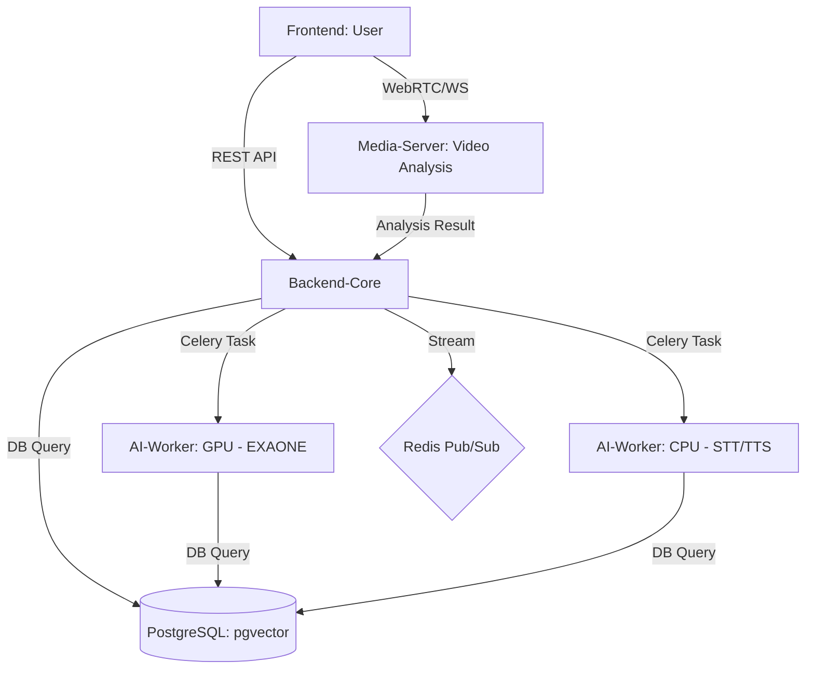

# 🏗️ System Architecture (최종 구현 버전)

**Big20 AI Interview Project**의 전체 시스템 구조와 모듈 구성을 설명합니다.

---

## 1. 전역 아키텍처 개요

본 프로젝트는 **고부하 AI 추론(LLM/Vision)**과 **실시간 미디어 처리(WebRTC/STT)**를 안정적으로 수행하기 위해 **마이크로서비스 아키텍처(MSA)**를 기반으로 설계되었습니다.

### 🌐 서비스 구성 (7개 서비스)

1. **Frontend (React 18)**: 사용자의 면접 화면, 결과 리포트 시각화 담당.
2. **Backend-Core (FastAPI)**: 인증, 면접 세션 관리, 데이터베이스 CRUD 담당.
3. **Media-Server (FastAPI/aiortc)**: WebRTC 중계 및 MediaPipe 기반 비전 분석 담당.
4. **AI-Worker (GPU)**: **EXAONE-3.5** 기반 질문 생성 및 답변 평가 담당.
5. **AI-Worker (CPU)**: **Faster-Whisper** STT 및 **Supertonic-2** TTS 처리 담당.
6. **PostgreSQL (18 + pgvector)**: 면접 기록, 이력서 벡터, 회원 데이터 저장.
7. **Redis (7)**: 메시지 브로커, AI 스트리밍 Pub/Sub, 분산 락 관리.

---

## 2. 데이터 흐름 (Data Flow)

### 🎯 핵심 워크플로우
- **질문 생성**: 이력서 업로드 → AI-Worker(GPU)가 KURE-v1 임베딩 후 RAG 기반 질문 생성.
- **실시간 면접**: WebRTC 연결 → Media-Server에서 시선/자세 분석 → AI-Worker(CPU)에서 STT/TTS 처리.
- **최종 평가**: 면접 완료 → AI-Worker(GPU)가 전체 대화록 및 비전 데이터를 분석하여 리포트 생성.

---

## 3. 기술 상세 (Actual Tech Stack)

| 레이어 | 기술 스택 | 세부 사항 |
| :--- | :--- | :--- |
| **언어/프레임워크** | Python 3.10, Node.js 20 | FastAPI, React 18 (Vite) |
| **LLM (AI)** | **EXAONE-3.5-7.8B** | GGUF 양자화 모델 (llama-cpp-python) |
| **Embedding** | **KURE-v1** | 한국어 최적화 1024차원 고성능 임베딩 |
| **STT (Voice)** | **Faster-Whisper** | `large-v3-turbo` 모델 기반 (자체 서버 구동) |
| **TTS (Voice)** | **Supertonic-2** | 고품질 한국어 음성 합성 엔진 |
| **Vision** | **MediaPipe** | FaceLandmarker 활용 실시간 시선/자세 추론 |
| **Database** | **PostgreSQL + pgvector** | 하이브리드 검색 (키워드 + 시맨틱) |

---

## 4. 아키텍처적 특성 (Key Features)

- **GPU/CPU 워커 분리**: EXAONE LLM 모델은 GPU 전용 큐에서, STT/TTS는 CPU 큐에서 병렬 처리하여 자원 최적화.
- **Redis 분산 락**: TTS 파일 중복 생성을 방지하고 일관성을 유지하기 위해 `SET NX` 락 사용.
- **실시간 스트리밍**: LLM 질문 생성 시 Redis Pub/Sub을 통해 토큰 단위로 프론트엔드에 실시간 타이핑 효과 제공.
- **세션 상태 복구**: `sessionStorage`와 백엔드 상태 동기화를 통해 예기치 못한 종료 시 진행 상황 복구 가능.

---
*문서 위치: `docs/readmelist/SYSTEM_ARCHITECTURE.md`*
