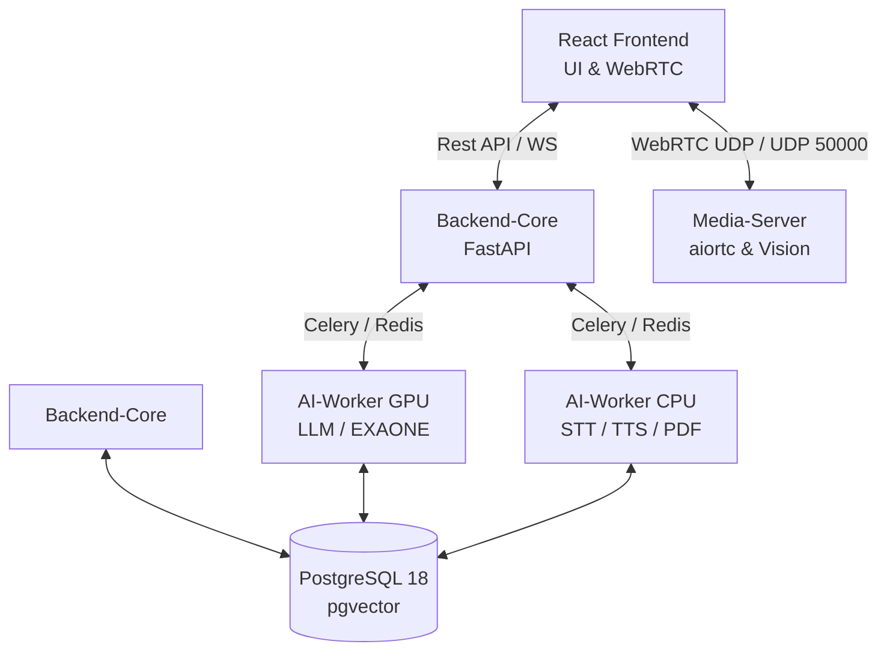

# 🏗️ System Architecture (최종 구현 및 진화 버전)

**Big20 AI Interview Project**의 전체 시스템 구조와 모듈 간의 유기적 연계 방식을 상세히 기술합니다. 초기 모놀리식 구조에서 고성능 비동기 MSA(Microservice Architecture)로 진화한 설계 기조를 반영하고 있습니다.

---

## 1. 전역 아키텍처 개요 (MSA & Containerization)

본 프로젝트는 **고부하 AI 추론(LLM/Vision/STT)**과 **초저지연 미디어 처리(WebRTC)**를 안정적으로 병기하기 위해 모든 컴포넌트를 독립된 Docker 컨테이너로 격리하여 운영합니다.

### 🌐 서비스 구성 (7대 독립 노드)

1.  **Frontend (React 18)**: Vite 기반 고속 빌드 환경. Glassmorphism UI 및 WebRTC/AudioWorklet 기반 미디어 제어 담당.
2.  **Backend-Core (FastAPI)**: JWT 인증, SQLModel ORM, Celery 태스크 발행 및 비즈니스 로집 집약체.
3.  **Media-Server (aiortc)**: Python 기반 WebRTC Signaling 및 MediaPipe를 활용한 실시간 비전(Vision) 분석 수행.
4.  **AI-Worker (GPU)**: `gpu_queue` 전담. **EXAONE-3.5** 기반 질문 생성 및 꼬리질문, 최종 심층 평가(Evaluation) 수행.
5.  **AI-Worker (CPU)**: `cpu_queue` 전담. **Faster-Whisper** 기반 STT 및 **Supertone-2** 기반 TTS, PDF 이력서 파싱 처리.
6.  **PostgreSQL (18 + pgvector)**: 하이브리드 저장소. 일반 RDBMS 데이터와 1024차원 벡터 데이터를 단일 Query JOIN으로 처리.
7.  **Redis (7)**: 분산 메시지 브로커(Broker) 겸 JWT 캐시 및 실시간 세션 상태(State) 관리소.

---

## 2. 핵심 데이터 및 명령 흐름 (Dynamic Flow)

### ⚡ 진화된 워크플로우 (Evolutionary Points)
# 🏗️ System Architecture (최종 구현 및 진화 버전)

**Big20 AI Interview Project**의 전체 시스템 구조와 모듈 간의 유기적 연계 방식을 상세히 기술합니다. 초기 모놀리식 구조에서 고성능 비동기 MSA(Microservice Architecture)로 진화한 설계 기조를 반영하고 있습니다.

---

## 1. 전역 아키텍처 개요 (MSA & Containerization)

본 프로젝트는 **고부하 AI 추론(LLM/Vision/STT)**과 **초저지연 미디어 처리(WebRTC)**를 안정적으로 병기하기 위해 모든 컴포넌트를 독립된 Docker 컨테이너로 격리하여 운영합니다.

### 🌐 서비스 구성 (7대 독립 노드)

1.  **Frontend (React 18)**: Vite 기반 고속 빌드 환경. Glassmorphism UI 및 WebRTC/AudioWorklet 기반 미디어 제어 담당.
2.  **Backend-Core (FastAPI)**: JWT 인증, SQLModel ORM, Celery 태스크 발행 및 비즈니스 로집 집약체.
3.  **Media-Server (aiortc)**: Python 기반 WebRTC Signaling 및 MediaPipe를 활용한 실시간 비전(Vision) 분석 수행.
4.  **AI-Worker (GPU)**: `gpu_queue` 전담. **EXAONE-3.5** 기반 질문 생성 및 꼬리질문, 최종 심층 평가(Evaluation) 수행.
5.  **AI-Worker (CPU)**: `cpu_queue` 전담. **Faster-Whisper** 기반 STT 및 **Supertone-2** 기반 TTS, PDF 이력서 파싱 처리.
6.  **PostgreSQL (18 + pgvector)**: 하이브리드 저장소. 일반 RDBMS 데이터와 1024차원 벡터 데이터를 단일 Query JOIN으로 처리.
7.  **Redis (7)**: 분산 메시지 브로커(Broker) 겸 JWT 캐시 및 실시간 세션 상태(State) 관리소.

---

## 2. 핵심 데이터 및 명령 흐름 (Dynamic Flow)

### ⚡ 진화된 워크플로우 (Evolutionary Points)
-   **자원 물리적 격리**: GPU VRAM 스파이크와 CPU I/O 병목이 충돌하지 않도록 Worker 컨테이너를 물리적으로 분리하여 `Exit Code 137(OOM)` 이슈를 근본적으로 차단했습니다.
-   **완전 비동기 처리**: LLM 추론 시 FastAPI 스레드가 블로킹되지 않도록 Redis 기반 Event-driven Task Queue를 도입하여 서버 응답 지연을 0ms 수준으로 최소화했습니다.
-   **Hybrid Vector Search**: 단일 SQL 쿼리로 이력서 문맥(Vector)과 사용자 정보(SQL)를 동시에 탐색하는 `pgvector` 최적화 아키텍처를 구현했습니다.

---

## 3. 기술 상세 (Actual Tech Stack)

| 레이어 | 기술 스택 | 세부 사항 및 도입 사유 |
| :--- | :--- | :--- |
| **인프라** | Docker Compose v2 | NVIDIA Container Toolkit 연동을 통한 GPU 할당 및 IaC 환경 구축 |
| **LLM (AI)** | **EXAONE-3.5-7.8B** | GGUF 4-bit 양자화 모델. 32K 컨텍스트 윈도우 및 한국어 최적화 프롬프트 튜닝 |
| **STT/TTS** | Faster-Whisper / Supertone | `large-v3-turbo` 모델 및 Redis 기반 분산 락/캐싱 적용 (중복 생성 방지) |
| **Vision** | MediaPipe | **5FPS Frame Skipping Sampling** 적용으로 서버 부하 80% 절감 및 실시간성 확보 |
| **Hardware** | **GTX 1660 SUPER / 64GB RAM** | GPU VRAM 6GB (공유 32GB) 확보 및 3.8GHz급 고성능 프로세서 환경 최적화 |
| **Networking** | WebRTC (aiortc) | **UDP 50000-50050** 포트 포워딩 및 ICE 홀펀칭을 통한 초저지연(300ms) 스트리밍 |

---

## 4. 운영 및 품질 관리 (DevOps & Quality)

-   **8단계 Git Flow 전략**: 모노레포(Monorepo) 환경에서의 병합 충돌을 방어하기 위해 엄격한 브랜치 관리 체계를 도입, 기존 대비 **충돌 발생률을 70% 감소**시켰습니다.
-   **장애 회복(Fault Tolerance)**: 특정 AI 워커 다운 시 `ImportError` 및 `Timeout` 예외를 Catch하여 하드코딩된 **Fallback Default Questions**를 즉시 로드하는 방어 로직을 탑재했습니다.
-   **보안 아키텍처**: JWT 기반 Stateless 인증과 DB IDOR 공격 방어를 위한 소유권 검증 로직을 전 엔드포인트에 적용했습니다.

---
*문서 위치: `docs/readmelist/SYSTEM_ARCHITECTURE.md`*
