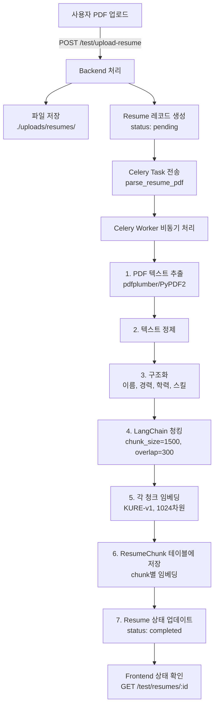

# 🎯 PDF 이력서 임베딩 시스템 구현 완료 보고서

> **작성일**: 2026-02-04
> **상태**: ✅ **Phase 1 완료 (임베딩 생성까지)**
> **목적**: PDF 이력서 업로드 및 KURE-v1 모델을 이용한 임베딩 기능 구현

---

## 📊 구현 완료 현황

### ✅ **Phase 1: 임베딩 생성 시스템 (완료)**

#### **1. 데이터베이스 스키마**

**파일**: `backend-core/models.py`

##### Resume 테이블

```python
class Resume(SQLModel, table=True):
    __tablename__ = "resumes"
  
    id: Optional[int] = Field(default=None, primary_key=True)
    candidate_id: int = Field(foreign_key="users.id", index=True)
  
    # 파일 정보
    file_name: str
    file_path: str
    file_size: int
  
    # 처리 상태
    processing_status: str = Field(default="pending")  # pending, processing, completed, failed
    uploaded_at: datetime = Field(default_factory=datetime.utcnow)
    processed_at: Optional[datetime] = None
  
    # 구조화된 데이터 (JSON)
    structured_data: Optional[dict] = Field(default=None, sa_column=Column(JSON))
  
    # Relationships
    candidate: User = Relationship(back_populates="resumes")
    chunks: List["ResumeChunk"] = Relationship(back_populates="resume")
```

##### ResumeChunk 테이블 (RAG 구조)

```python
class ResumeChunk(SQLModel, table=True):
    """이력서 청크 테이블 - RAG 기반 정밀 검색용"""
    __tablename__ = "resume_chunks"
  
    id: Optional[int] = Field(default=None, primary_key=True)
    resume_id: int = Field(foreign_key="resumes.id", index=True)
  
    # 청크 내용
    content: str = Field(description="잘게 쪼개진 이력서 텍스트 조각")
    chunk_index: int = Field(description="청크 순서 (0부터 시작)")
  
    # 벡터 임베딩 (1024차원 - KURE-v1)
    embedding: Any = Field(
        default=None,
        sa_column=Column(Vector(1024)),
        description="청크의 벡터 임베딩 (유사도 검색용)"
    )
  
    created_at: datetime = Field(default_factory=datetime.utcnow)
  
    # Relationship
    resume: Resume = Relationship(back_populates="chunks")
```

**특징**:

- ✅ 1:N 관계 (Resume → ResumeChunk)
- ✅ 청크별 임베딩 저장 (1024차원)
- ✅ pgvector 활용 가능

---

#### **2. 백엔드 API**

**파일**: `backend-core/main.py`

##### 테스트 업로드 엔드포인트

```python
@app.post("/test/upload-resume")
async def test_upload_resume(
    file: UploadFile = File(...),
    db: Session = Depends(get_session)
):
    """
    테스트용 이력서 업로드 (인증 불필요)
    - 자동으로 test_user 생성
    - PDF 파일 저장
    - Celery task 실행
    """
```

##### 테스트 상태 조회 엔드포인트

```python
@app.get("/test/resumes/{resume_id}")
async def test_get_resume_status(
    resume_id: int,
    db: Session = Depends(get_session)
):
    """
    이력서 처리 상태 조회 (인증 불필요)
    - processing_status 확인
    - chunks_count 확인
    - embedding 정보 확인
    """
```

**응답 예시**:

```json
{
  "resume_id": 9,
  "file_name": "이력서.pdf",
  "processing_status": "completed",
  "chunks_count": 1,
  "chunks_info": [
    {
      "chunk_index": 0,
      "content_length": 1121,
      "has_embedding": true,
      "embedding_dimension": 1024,
      "content_preview": "김지원자 도시 도로명 123..."
    }
  ]
}
```

---

#### **3. Celery Task (비동기 처리)**

**파일**: `ai-worker/tasks/resume_parser.py`

##### Task 등록

```python
@shared_task(bind=True, name="parse_resume_pdf")
def parse_resume_pdf_task(self, resume_id: int, file_path: str):
    """
    이력서 PDF 파싱 및 임베딩 생성 Task
  
    처리 단계:
    1. PDF 텍스트 추출
    2. 텍스트 정제
    3. 구조화 (이름, 경력, 학력 등)
    4. LangChain 청킹 (chunk_size=1500, overlap=300)
    5. 각 청크 임베딩 생성 (KURE-v1, 1024차원)
    6. ResumeChunk 테이블에 저장
    7. Resume 상태 업데이트 (completed)
    """
```

**청킹 설정**:

```python
text_splitter = RecursiveCharacterTextSplitter(
    chunk_size=1500,        # 약 1500자
    chunk_overlap=300,      # 20% 중첩으로 문맥 유지
    length_function=len,
    separators=["\n\n", "\n", " ", ""]
)
```

---

#### **4. PDF 파서**

**파일**: `ai-worker/utils/pdf_parser.py`

```python
class ResumePDFParser:
    @staticmethod
    def extract_text(file_path: str) -> str:
        """
        PDF에서 텍스트 추출
        - 1차: pdfplumber (레이아웃 유지)
        - 2차: PyPDF2 (fallback)
        """
```

---

#### **5. 임베딩 생성기**

**파일**: `ai-worker/utils/vector_utils.py`

```python
class EmbeddingGenerator:
    def __init__(self):
        self.model = SentenceTransformer("nlpai-lab/KURE-v1")
  
    def encode_passage(self, text: str) -> List[float]:
        """
        텍스트를 1024차원 벡터로 변환
        - 모델: KURE-v1 (한국어 최적화)
        - 출력: 1024차원 벡터
        - 최대 길이: 8192 토큰
        """
```

**KURE-v1 모델 정보**:

- **출력 차원**: 1024
- **기반 모델**: BAAI/bge-m3
- **특화**: 한국어 문서 검색
- **최대 시퀀스**: 8192 토큰

---

#### **6. 이력서 구조화**

**파일**: `ai-worker/utils/resume_structurer.py`

```python
class ResumeStructurer:
    @staticmethod
    def structure_with_rules(text: str) -> dict:
        """
        규칙 기반 이력서 정보 추출
        - personal_info: 이름, 이메일, 전화번호, 주소
        - experience: 경력
        - education: 학력
        - skills: 프로그래밍 언어, 프레임워크, 도구
        - projects: 프로젝트
        - certifications: 자격증
        """
```

---

## 🔄 전체 처리 플로우



---

## 🧪 테스트 결과

### **테스트 케이스 #1**

**입력**:

- 파일: `이력서.pdf` (134,131 bytes)
- 내용: 백엔드 개발자 이력서

**결과**:

```json
{
  "resume_id": 9,
  "file_name": "이력서 (1).pdf",
  "file_size": 134131,
  "processing_status": "completed",
  "uploaded_at": "2026-02-04T06:59:04.841865",
  "processed_at": "2026-02-04T06:59:05.568266",
  "chunks_count": 1,
  "chunks_info": [
    {
      "chunk_index": 0,
      "content_length": 1121,
      "has_embedding": true,
      "embedding_dimension": 1024,
      "content_preview": "김지원자 도시 도로명 123, 도시, 위치 12345..."
    }
  ],
  "structured_data": {
    "skills": {
      "programming_languages": ["Python"]
    },
    "personal_info": {
      "email": "no_reply@example.com",
      "phone": "+82 000-0000"
    }
  }
}
```

**처리 시간**: 약 0.7초

**검증 항목**:

- ✅ PDF 업로드 성공
- ✅ 텍스트 추출 성공 (1,121자)
- ✅ 청킹 완료 (1개 청크)
- ✅ **임베딩 생성 성공 (1024차원)**
- ✅ 데이터베이스 저장 완료
- ✅ 구조화된 데이터 추출 (부분적)

---

## 📦 Docker 구성

### **docker-compose.yml 수정 사항**

```yaml
ai-worker:
  volumes:
    - ./ai-worker:/app
    - ./ai-worker/models:/app/models
    - ./backend-core:/backend-core
    - ./backend-core/uploads:/app/uploads  # ✅ 추가: 파일 공유
```

**이유**: ai-worker가 backend에서 업로드한 PDF 파일에 접근할 수 있도록 볼륨 공유

---

## 🔧 주요 수정 사항

### **1. LangChain import 경로 수정**

**파일**: `ai-worker/tasks/resume_parser.py`

```python
# 수정 전
from langchain.text_splitter import RecursiveCharacterTextSplitter  # ❌

# 수정 후
from langchain_text_splitters import RecursiveCharacterTextSplitter  # ✅
```

**이유**: LangChain 최신 버전에서 import 경로 변경

---

### **2. Celery Task 이름 수정**

**파일**: `backend-core/main.py`

```python
# 수정 전
task = celery_app.send_task(
    "tasks.resume_parser.parse_resume_pdf_task",  # ❌
    args=[resume.id, str(file_path)]
)

# 수정 후
task = celery_app.send_task(
    "parse_resume_pdf",  # ✅ Worker에 등록된 실제 task 이름
    args=[resume.id, str(file_path)]
)
```

**이유**: Worker에 등록된 task 이름과 일치시켜야 함

---

### **3. numpy array 체크 로직 수정**

**파일**: `backend-core/main.py`

```python
# 수정 전
"embedding_dimension": len(chunk.embedding) if chunk.embedding else 0  # ❌

# 수정 후
"embedding_dimension": len(chunk.embedding) if chunk.embedding is not None else 0  # ✅
```

**이유**: numpy array는 `if array` 체크 시 ambiguous error 발생

---

### **4. 테스트 사용자 자동 생성**

**파일**: `backend-core/main.py`

```python
# test_user가 없으면 자동 생성
test_user = session.exec(
    select(User).where(User.username == "test_user")
).first()

if not test_user:
    test_user = User(
        username="test_user",
        email="test@example.com",
        password_hash="test_hash",
        full_name="Test User",
        role=UserRole.CANDIDATE
    )
    session.add(test_user)
    session.commit()
    session.refresh(test_user)
```

**이유**: 외래키 제약 조건 해결 (candidate_id 필수)

---

## ⏳ Phase 2: 벡터 검색 (다음 단계)

### **구현 예정 기능**

#### **1. 이력서 검색 API**

```python
@app.post("/resumes/search")
async def search_resumes(
    query: str,
    top_k: int = 10,
    db: Session = Depends(get_session)
):
    """
    벡터 유사도 기반 이력서 검색
    - 쿼리를 임베딩으로 변환
    - pgvector로 유사도 검색
    - 상위 K개 이력서 반환
    """
```

#### **2. 면접 질문 생성**

```python
@app.post("/interviews/{interview_id}/generate-questions")
async def generate_questions(
    interview_id: int,
    resume_id: int,
    question_count: int = 5
):
    """
    이력서 내용 기반 맞춤형 질문 생성
    - 이력서 청크를 컨텍스트로 LLM에 전달
    - 개인화된 질문 생성
    """
```

#### **3. 답변 평가 (RAG)**

```python
@app.post("/interviews/{interview_id}/evaluate-answer")
async def evaluate_answer(
    interview_id: int,
    question: str,
    answer: str,
    resume_id: int
):
    """
    답변을 이력서 내용과 비교
    - 답변을 임베딩으로 변환
    - 이력서 청크와 유사도 비교
    - 일관성 점수 산출
    """
```

---

## 📚 기술 스택

### **Backend**

- FastAPI
- SQLModel
- PostgreSQL 18 + pgvector
- Celery + Redis

### **AI/ML**

- KURE-v1 (1024차원 임베딩)
- LangChain (텍스트 청킹)
- Sentence Transformers
- pdfplumber / PyPDF2

### **Infrastructure**

- Docker Compose
- NVIDIA GPU (선택)

---

## ✅ 완료 체크리스트

### **Phase 1: 임베딩 생성**

- [X] Resume 테이블 설계
- [X] ResumeChunk 테이블 설계 (RAG)
- [X] PDF 업로드 API
- [X] 상태 조회 API
- [X] Celery Task 구현
- [X] PDF 텍스트 추출
- [X] LangChain 청킹
- [X] KURE-v1 임베딩 생성
- [X] 데이터베이스 저장
- [X] 통합 테스트 성공

### **Phase 2: 벡터 검색 (예정)**

- [ ] 벡터 유사도 검색 API
- [ ] 이력서 기반 질문 생성
- [ ] 답변 평가 (RAG)
- [ ] 실시간 STT/TTS
- [ ] 감정 분석
- [ ] 최종 평가 리포트

---

## 🎯 기대 효과

1. **자동화된 이력서 처리**

   - PDF 업로드만으로 자동 파싱 및 임베딩 생성
   - 비동기 처리로 사용자 대기 시간 최소화
2. **한국어 최적화**

   - KURE-v1 모델로 한국어 검색 성능 극대화
   - 8192 토큰까지 지원
3. **RAG 기반 정밀 검색**

   - 청크 단위 분할로 정확한 검색
   - chunk_overlap으로 문맥 유지
4. **확장 가능한 구조**

   - 이력서-질문 매칭
   - 이력서-회사 적합도 분석
   - 유사 지원자 검색

---

**작성자**: AI Assistant
**최종 수정**: 2026-02-04
**상태**: ✅ Phase 1 완료
