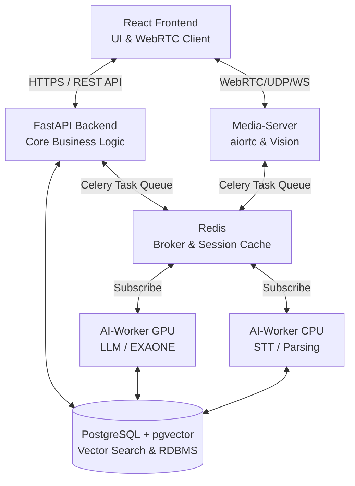

# System Architecture Design (SAD)
**프로젝트명**: Big20 AI 면접 프로젝트 (Big20 AI Interview Project)
**문서 버전**: 1.0 (최신 배포 및 코드베이스 기준 반영)

---

## 1. 개요 (Introduction)

### 1.1 목적
본 문서(SAD, System Architecture Design)는 Big20 AI 면접 시스템의 소프트웨어 아키텍처에 대한 전반적인 통찰력을 제공하기 위해 작성되었습니다. 설계 원칙, 시스템 구성 요소, 각 모듈 간의 협력 및 통신 방식, 데이터 흐름, 인프라 배포 관점을 다루어 시스템 생명 주기 동안 개발자와 이해관계자의 의사결정 지침으로 활용됩니다.

### 1.2 시스템 범위
Big20 AI 면접 시스템은 최신 AI 기술(LLM, STT, Vision AI)과 WebRTC 통신을 결합하여 실제와 유사한 상호작용형 면접 환경을 제공합니다. 
주요 기능은 다음과 같습니다:
- RAG 기반 이력서 파싱 및 맞춤형/꼬리물기 질문 생성
- WebRTC 기반 저지연 화상/음성 스트리밍 환경 제공
- 실시간 Vision 감정 분석 (MediaPipe/OpenCV) 및 발화 분석(Whisper STT)
- LLM 기반 정밀 채점 및 다차원 통합 피드백 대시보드

---

## 2. 아키텍처 목표 및 제약사항 (Goals & Constraints)

- **유연성 및 비동기 처리**: 고사양 AI 추론 작업(LLM 생성, STT 변환)으로 인한 동기식 병목을 막기 위해 Celery(메시지 큐) 기반의 느슨히 결합된 MSA(Microservice Architecture) 지향.
- **리소스 분리 보장**: CPU 집약적 작업(WebRTC, 비즈니스 로직, Vision 경량 분석)과 GPU 집약적 작업(음성 텍스트화, 대형 언어 모델 추론)을 별도의 워커(Worker) 컨테이너로 격리 조치.
- **배포 이식성**: Windows, Linux 등 OS에 구애받지 않고 동작하기 위해 Docker Compose 기반 단일 통합 컨테이너 환경 강제 구축.

---

## 3. 컨테이너 뷰 (Container View - C4 Model Level 2)

시스템은 6대 주요 컨테이너 노드로 구성됩니다.

### 3.1 Frontend (User Interface)
- **스택**: React 18, Vite, Axios, Tailwind CSS
- **역할**: 사용자 대시보드(Glassmorphism UI) 제공, WebRTC 연결 및 브라우저 미디어 API 제어, 실시간 질문 텍스트 표시 및 답변/STT 결과 피드백.

### 3.2 Backend-Core (Main Server)
- **스택**: FastAPI, SQLModel (Pydantic), asyncio, Celery
- **역할**: 사용자 인증(JWT), REST API 엔드포인트 제공, 면접 세션(대기/진행/완료) 통제, 데이터베이스 트랜잭션 및 Celery Task 위임, LLM(Llama-3.1-8B) Context 기반 질문 생성 관리.

### 3.3 Media-Server (WebRTC & Vision)
- **스택**: aiortc(WebRTC), FastAPI, MediaPipe(VisionAnalyzer), NumPy
- **역할**: P2P 미디어 스트리밍 릴레이 지원, 실시간 비디오 프레임 추출을 통한 감정/표정(dominant_emotion) 분석 및 눈 깜빡임 분석, 오디오 버퍼링 후 STT 변환 요청. (※ 현재 내부 로컬 whisper와 API 연동 방식 혼용)

### 3.4 AI-Worker (Data Processing / Inference)
- **스택**: Celery, PyTorch, LangChain, fast-whisper, supertone(TTS), Llama-3.1-8B / Solar-10.7B
- **역할 (GPU Mode)**: `gpu_queue`를 구독. 인재상 및 이력서 기반 정밀 질문 생성, 면접 결과 기술적/논리적 정밀 평가(Evaluator).
- **역할 (CPU Mode)**: `cpu_queue`를 구독. 오디오 청크 텍스트화(STT), 이력서 PDF 파싱.

---

## 4. 데이터 및 정보 뷰 (Data / Information View)

단일 관계형 데이터베이스(`PostgreSQL`) 내에서 벡터 인덱스와 정형 데이터를 통합 관리하여 복잡성을 줄입니다.

- **DBMS**: PostgreSQL 18
- **Extension**: `pgvector` (RAG용 1024차원 고정 벡터 서치 기능 탑재)
- **핵심 엔티티(테이블) 구성**:
  - `Users`: 사용자 계정 정보 (`id`, `email`, `password_hash`, `role`)
  - `InterviewSessions (Interviews)`: 면접 세션 정보 (`id`, `user_id`, `status`, `created_at`)
  - `Questions`: 생성된 타겟 질문 (`id`, `session_id`, `content`, `embedding`)
  - `Transcripts (Answers)`: 사용자 발화 내용 및 AI 질문 답변 이력 (`id`, `question_id`, `transcript`, `evaluation`)
  - `Emotions`: 비전 AI에서 도출된 감정 분석 결과 단위 (`id`, `answer_id`, `timestamp`, `emotion_type`, `score`)

- **세션 데이터 (캐싱)**: Redis를 통해 순간적인 세션 상태(Connection), Celery의 Message Broker 용도로 사용. 단기 데이터 수명 주기 적용.

---

## 5. 프로세스 뷰 (Process View - 핵심 동적 흐름)

### 5.1 실시간 면접 분석 파이프라인 (Real-time Streaming Pipeline)
1. **시그널링**: Frontend가 SDP 정보 송신 -> Media-Server 8080 포트와 P2P 연결 시도. (로컬 환경 지원을 위해 NAT 우회 / Host IP 마스킹 적용).
2. **시각 분석 흐름 (Vision)**: Media-Server 내 `Start_video_analysis` 태스크가 활성화되어 백그라운드로 5FPS 마다 VideoTrack에서 프레임 추출. MediaPipe 모델을 통한 랜드마크 분석 및 정서 스코어링 진행.
3. **음성 인식 흐름 (STT)**: Frontend 사용자 발화 발생 시, Media-Server에서 이를 NumPy로 분석하여 '자신감(성량/속도)'을 판별해 점수화하고 3초 버퍼로 조각내어 AI-Worker-CPU에 Celery Task 형태로 원격 STT 변환 지시.
4. **꼬리 질문 흐름 (Dynamics)**: STT 결과 생성 시 Backend-Core를 경유하여 AI-Worker-GPU(LLM)에 꼬리 질문 생성 트리거 발동. 도출된 텍스트가 Frontend 로 소켓 송신됨.

### 5.2 종합 채점 파이프라인 (Evaluation Pipeline)
1. 세션 종료(`completed` 상태 전환) 트리거 작동.
2. AI-Worker-GPU 모듈에서 면접간 발생된 전체 `Transcripts`(문답 기록)와 Media-Server가 업로드한 `Behavior_Scores`(행동/정서 점수) 데이터를 픽업.
3. **동적 프롬프트 매핑**: 지원한 기업 인재상(`Companies`) 및 직무 요건 중심의 루브릭 체계 로드.
4. LLM 병렬 채점 알고리즘 기동 -> JSON 결과 산출 -> DB 저장 -> Frontend 대시보드 랜더링.

---

## 6. 배포 아키텍처 뷰 (Deployment View)

- 전체 시스템은 **Docker Compose**를 기반으로 오케스트레이션 수행.
- **네트워크 (Virtual Network)**: `interview_network` 브릿지를 구성하여 컴포넌트 간 호스트 도메인을 DNS 처리 (e.g. `redis:6379`, `backend:8000`).
- **하드웨어 가속**: `deploy.reservations.devices` 설정으로 Docker 컨테이너 레벨에 NVIDIA GPU 할당.
- **포트 바인딩 정책**:
  - `8000` : Backend API
  - `8080` : Media-Server WebRTC Signaling & WebSocket
  - `50000-50050/udp` : WebRTC ICE Candidate 데이터 전문 채널 (Docker NAT 트래버스 지원을 위해 소켓 몽키 패칭 적용)
  - `3000` : React Client 서버

---

## 7. 보안 관리 전략 (Security & Compliance)

- **인가 구조 (Authorization)**: JWT 기반 Stateless 방식を採用. `users.role` (Candidate / Recruiter / Admin)을 기준으로 FastAPI 의존성(`Depends(get_current_user)`)을 거쳐 엔드포인트 접근 통제 실시.
- **민감 데이터 보호**: `.env` 파일에 데이터베이스 패스워드, HuggingFace/LangChain 등 외부 API 토큰을 중앙 관리. Docker 로딩 과정을 통해서만 주입. 
- **내부망 격리 정책**: Database 인스턴스와 Redis 브로커는 호스트 포트 퍼블리싱을 방지하고 백엔드 티어 네트워크 안에서만 통신하도록 제한.

---

## 8. 향후 고도화 및 품질 목표 (Future Architecture Refinement)

- **분산 확장 (Scale-Out)**: 현 시점에서는 단일 Redis 메시지 브로커가 컨테이너를 스케줄링 중이나, 대규모 동시 면접 트래픽 대응 시 Celery Worker 복제 수량 및 Kafka 전환 검토.
- **모델 경량화 (Quantization)**: GPU 메모리 대역폭(VRAM) 의존도를 낮추기 위해 EXAONE 등 LLM 모델의 AWQ/GGUF 4bit 양자화 추론기 도입 적극 검토.
- **옵저버빌리티(Observability)**: LangSmith 로깅을 통한 LLM 응답 품질 트레이싱과 더불어 APM 도구 스택 모니터링 체계 보강 필요.
