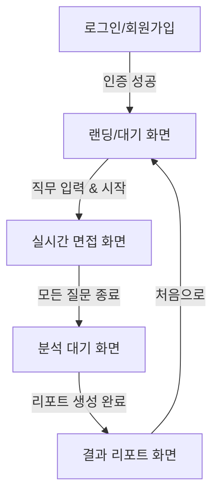

# 화면 정의서 (Screen Definitions)

본 문서는 AI 모의면접 플랫폼의 프론트엔드 UI/UX 설계 및 기능 정의를 기술합니다.
현재 `App.jsx`에 구현된 싱글 페이지 애플리케이션(SPA) 로직을 기준으로 작성되었습니다.

---

## 1. 화면 흐름도 (Screen Flow)

---

## 2. 상세 화면 정의

### 2.1 로그인/회원가입 화면 (Auth Screen)
- **화면 ID**: SCR-001
- **진입 조건**: 서비스 최초 접속 또는 로그아웃 상태
- **주요 기능**:
  - **로그인 탭**: 아이디/비밀번호 입력, 로그인 버튼
  - **회원가입 탭**: 이메일, 성함, 아이디, 비밀번호 입력, 회원가입 버튼
  - **유효성 검사**: 입력 필드 누락 시 에러 메시지 표시
  - **토큰 처리**: 인증 성공 시 JWT 토큰을 로컬 스토리지에 저장하고 랜딩 화면으로 이동

### 2.2 랜딩/설정 화면 (Landing Screen)
- **화면 ID**: SCR-002
- **진입 조건**: 로그인 성공 시
- **주요 기능**:
  - **사용자 정보 표시**: 환영 인사 및 로그아웃 버튼
  - **면접 설정**: 지원 직무(Position) 입력 필드 (예: "Frontend 개발자")
  - **면접 시작**: '면접 시작' 버튼 클릭 시 면접 세션 생성 및 질문 로딩

### 2.3 실시간 면접 화면 (Interview Screen)
- **화면 ID**: SCR-003
- **진입 조건**: 면접 세션 생성 완료
- **UI 구성**:
  - **상단**: 현재 질문 내용 (예: "질문 1: React의 생명주기에 대해 설명해주세요.")
  - **중앙**: WebRTC 기반 내 얼굴 영상 (Video Stream)
  - **하단 (인터랙션)**:
    - **실시간 STT**: 사용자의 발화 내용이 텍스트로 변환되어 실시간 표시
    - **녹음 컨트롤**: '녹음 시작' / '녹음 중지' 토글 버튼
    - **네비게이션**: '다음 질문' 버튼 (마지막 질문일 경우 '면접 종료' 버튼)
- **기술적 특징**:
  - 브라우저의 카메라/마이크 권한 획득
  - WebSocket을 통한 오디오 스트림 전송 및 STT 결과 수신

### 2.4 분석 대기 화면 (Loading Screen)
- **화면 ID**: SCR-004
- **진입 조건**: 면접 종료 버튼 클릭 시
- **주요 기능**:
  - AI(Solar-10.7B)가 답변을 분석하고 평가 리포트를 생성하는 동안 로딩 인디케이터 표시
  - 약 10초 내외의 대기 시간 안내 (비동기 처리)

### 2.5 결과 리포트 화면 (Result Screen)
- **화면 ID**: SCR-005
- **진입 조건**: 분석 완료 시
- **UI 구성**:
  - **종합 점수**: 100점 만점 기준의 총점 표시
  - **상세 점수 카드**:
    - 기술 점수 (Technical Score)
    - 소통 능력 (Communication Score)
    - 문화 적합성 (Cultural Fit Score)
  - **상세 피드백**:
    - 종합 평가 (Summary)
    - 강점 (Strengths)
    - 개선점 (Areas for Improvement)
    - 채용 추천 의견 (Recommendation)
  - **네비게이션**: '처음으로' 버튼 클릭 시 랜딩 화면으로 복귀

---

## 3. 공통 UI 가이드 (Style Guide)
*현재 `index.css` 기준*

- **테마**: Dark Mode 기반 (배경색: `#1a1a1a`)
- **컨테이너**: `max-width: 800px`, 중앙 정렬
- **카드 스타일**:
  - 배경: `rgba(255, 255, 255, 0.05)` (반투명 글래스모피즘 효과)
  - 테두리: 1px solid `rgba(255, 255, 255, 0.1)`
  - 둥근 모서리: `16px`
- **타이포그래피**:
  - 기본 폰트 색상: `#ffffff` (가독성을 위한 밝은 흰색)
  - 포인트 색상:
    - Primary: `#3b82f6` (Blue)
    - Success: `#10b981` (Green)
    - Warning: `#f59e0b` (Amber)
    - Danger: `#ef4444` (Red)
