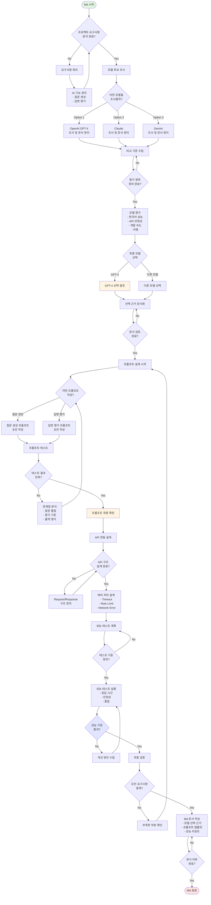

```mermaid
flowchart TD
    Start([MA 시작]) --> A{프로젝트 요구사항<br/>분석 완료?}
  
    A -->|No| B[요구사항 회의]
    B --> C[AI 기능 정의<br/>- 질문 생성<br/>- 답변 평가]
    C --> A
  
    A -->|Yes| D[모델 후보 조사]
  
    D --> E{어떤 모델을<br/>조사할까?}
    E -->|Option 1| F1[OpenAI GPT-4<br/>조사 및 문서 정리]
    E -->|Option 2| F2[Claude<br/>조사 및 문서 정리]
    E -->|Option 3| F3[Gemini<br/>조사 및 문서 정리]
  
    F1 --> G[비교 기준 수립]
    F2 --> G
    F3 --> G
  
    G --> H{평가 항목<br/>정의 완료?}
    H -->|No| G
    H -->|Yes| I[모델 평가<br/>- 한국어 성능<br/>- API 안정성<br/>- 개발 속도<br/>- 비용]
  
    I --> J{최종 모델<br/>선택}
    J -->|GPT-4| K1[GPT-4 선택 결정]
    J -->|다른 모델| K2[다른 모델 선택]
  
    K1 --> L[선택 근거 문서화]
    K2 --> L
  
    L --> M{문서 검토<br/>완료?}
    M -->|No| L
    M -->|Yes| N[프롬프트 설계 시작]
  
    N --> O{어떤 프롬프트<br/>작성?}
    O -->|질문 생성| P1[질문 생성 프롬프트<br/>초안 작성]
    O -->|답변 평가| P2[답변 평가 프롬프트<br/>초안 작성]
  
    P1 --> Q[프롬프트 테스트]
    P2 --> Q
  
    Q --> R{테스트 결과<br/>만족?}
    R -->|No| S[문제점 분석<br/>- 질문 품질<br/>- 평가 기준<br/>- 출력 형식]
    S --> O
  
    R -->|Yes| T[프롬프트 최종 확정]
  
    T --> U[API 연동 설계]
  
    U --> V{API 구조<br/>설계 완료?}
    V -->|No| W[Request/Response<br/>구조 정의]
    W --> V
  
    V -->|Yes| X[에러 처리 설계<br/>- Timeout<br/>- Rate Limit<br/>- Network Error]
  
    X --> Y[성능 테스트 계획]
  
    Y --> Z{테스트 기준<br/>정의?}
    Z -->|No| Y
    Z -->|Yes| AA[성능 테스트 실행<br/>- 응답 시간<br/>- 안정성<br/>- 품질]
  
    AA --> AB{성능 기준<br/>통과?}
    AB -->|No| AC[개선 방안 수립]
    AC --> AA
  
    AB -->|Yes| AD[최종 검증]
  
    AD --> AE{모든 요구사항<br/>충족?}
    AE -->|No| AF[부족한 부분 확인]
    AF --> N
  
    AE -->|Yes| AG[MA 문서 작성<br/>- 모델 선택 근거<br/>- 프롬프트 템플릿<br/>- 성능 리포트]
  
    AG --> AH{문서 리뷰<br/>완료?}
    AH -->|No| AG
    AH -->|Yes| End([MA 완료])
  
    style Start fill:#e1f5e1
    style End fill:#ffe1e1
    style K1 fill:#fff4e1
    style T fill:#fff4e1
    style AB fill:#e1e5ff
```
