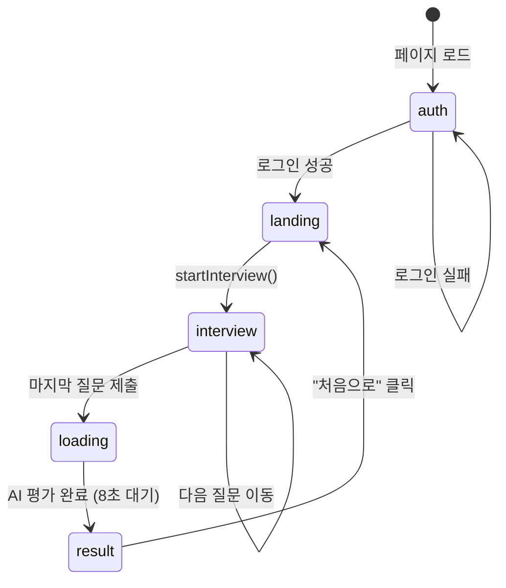
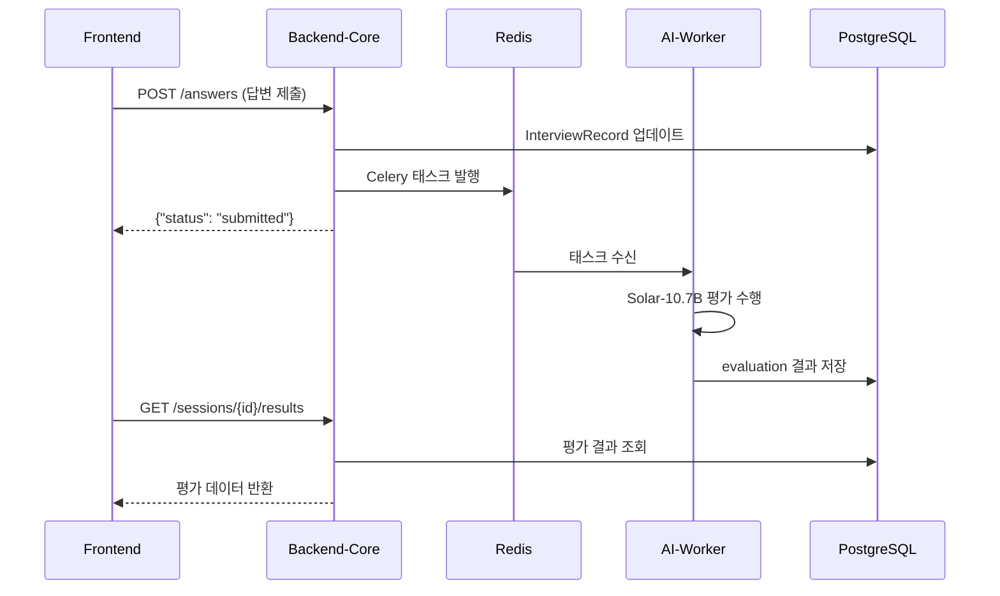

# AI 면접 시스템 상세 구현 가이드

> **작성 기준**: `wbs_output_sj.md` 산출물 기반 + 전체 코드 분석 결과

---

## 📌 문서 개요

이 문서는 WBS 산출물(DB 연동 기준서, UI/UX 화면설계서, API 정의서)에 정의된 설계 기준을 실제 코드와 매핑하여, 각 기능을 어떻게 구현하면 되는지 **상세하게 안내**합니다.

---

## 목차

1. [DB 연동 구현 가이드](#1-db-연동-구현-가이드)
2. [UI/UX 화면 구현 가이드](#2-uiux-화면-구현-가이드)
3. [API 구현 가이드](#3-api-구현-가이드)
4. [서비스별 구현 세부사항](#4-서비스별-구현-세부사항)
5. [실행 및 테스트 가이드](#5-실행-및-테스트-가이드)

---

## 1. DB 연동 구현 가이드

### 1.1 데이터 흐름 설계 (WBS 문서 2장 기준)

WBS에서 정의한 데이터 흐름:

```
사용자 입력 → STT/영상 분석 → 질문 생성/답변 평가(LLM) → 상태 갱신 → DB 저장 → 결과 리포트
```

**현재 코드 구현 위치**:

| 단계                   | 담당 서비스                       | 파일 위치                                                                                                   |
| ---------------------- | --------------------------------- | ----------------------------------------------------------------------------------------------------------- |
| 사용자 입력(음성/영상) | `media-server`                  | [main.py](file:///c:/big20/git/Big20_aI_interview_project/media-server/main.py)                                |
| STT 처리               | `media-server` → Deepgram API  | `start_stt_with_deepgram()` 함수 (L78-168)                                                                |
| 영상 분석              | `media-server` → `ai-worker` | `VideoAnalysisTrack` 클래스 (L46-76)                                                                      |
| 질문 생성              | `ai-worker` (Celery)            | [question_generator.py](file:///c:/big20/git/Big20_aI_interview_project/ai-worker/tasks/question_generator.py) |
| 답변 평가              | `ai-worker` (Celery)            | [evaluator.py](file:///c:/big20/git/Big20_aI_interview_project/ai-worker/tasks/evaluator.py)                   |
| DB 저장                | `backend-core`                  | [database.py](file:///c:/big20/git/Big20_aI_interview_project/backend-core/database.py)                        |

---

### 1.2 저장소 구성 (WBS 문서 3장 기준)

| 저장소 유형                  | 구현 상태        | 구현 방법                               |
| ---------------------------- | ---------------- | --------------------------------------- |
| **RDBMS (PostgreSQL)** | ✅ 구현됨        | `docker-compose.yml`의 `db` 서비스  |
| **로그 저장소**        | ⚠️ 기본 로깅만 | Python `logging` 모듈 사용            |
| **벡터 DB (RAG용)**    | ⚠️ 확장 설치만 | `init.sql`에 `pgvector` 확장 설치됨 |

#### 📝 TODO: 벡터 DB 활용 확장 구현

현재 `init.sql`에 `CREATE EXTENSION IF NOT EXISTS vector;`가 있지만, 실제 임베딩 저장/검색 로직이 없습니다.

**구현 방법**:

```sql
-- 임베딩 테이블 추가 (init.sql에 추가)
CREATE TABLE IF NOT EXISTS question_embeddings (
    id SERIAL PRIMARY KEY,
    question_text TEXT NOT NULL,
    embedding vector(768),  -- Sentence-Transformer 768차원
    created_at TIMESTAMP DEFAULT NOW()
);
```

```python
# backend-core/models.py에 추가
from pgvector.sqlalchemy import Vector

class QuestionEmbedding(SQLModel, table=True):
    id: Optional[int] = Field(default=None, primary_key=True)
    question_text: str
    embedding: List[float] = Field(sa_column=Column(Vector(768)))
```

---

### 1.3 핵심 엔티티 (WBS 문서 4장 기준)

WBS에서 정의한 엔티티와 현재 코드 매핑:

| WBS 엔티티            | 현재 모델                      | 파일 위치                                                                                       | 상태 |
| --------------------- | ------------------------------ | ----------------------------------------------------------------------------------------------- | ---- |
| `USER`              | `User`                       | [models.py L6-11](file:///c:/big20/git/Big20_aI_interview_project/backend-core/models.py#L6-L11)   | ✅   |
| `INTERVIEW_SESSION` | `InterviewSession`           | [models.py L17-28](file:///c:/big20/git/Big20_aI_interview_project/backend-core/models.py#L17-L28) | ✅   |
| `QUESTION`          | `InterviewRecord` (통합)     | [models.py L30-53](file:///c:/big20/git/Big20_aI_interview_project/backend-core/models.py#L30-L53) | ✅   |
| `ANSWER`            | `InterviewRecord` (통합)     | 위와 동일                                                                                       | ✅   |
| `EVALUATION`        | `InterviewRecord.evaluation` | JSONB 컬럼                                                                                      | ✅   |
| `STATE_HISTORY`     | ❌ 미구현                      | -                                                                                               | 🔴   |

#### 📝 TODO: STATE_HISTORY 테이블 구현

WBS 문서에서 요구하는 상태 이력 추적을 위해 새 모델 추가 필요:

```python
# backend-core/models.py에 추가
class StateHistory(SQLModel, table=True):
    """상태 변경 이력 추적용 테이블"""
    id: Optional[int] = Field(default=None, primary_key=True)
    session_id: int = Field(foreign_key="interviewsession.id", index=True)
  
    # WBS 5.1장 State 구성 요소
    scenario: str  # 면접 시나리오 (기술/인성/종합)
    stage: str     # 현재 단계 (intro/question/answer/evaluation/complete)
    intent: Optional[str] = None  # 사용자 의도 분석 결과
    evaluation: Optional[Dict[str, Any]] = Field(default=None, sa_column=Column(JSONB))
    next_action: str  # 다음 동작 (next_question/retry/end)
    retry_count: int = Field(default=0)
  
    created_at: datetime = Field(default_factory=datetime.utcnow)
```

---

### 1.4 DB 연동 원칙 구현 (WBS 문서 6장 기준)

| 원칙              | 구현 위치                    | 구현 방법                                   |
| ----------------- | ---------------------------- | ------------------------------------------- |
| API 단위 트랜잭션 | `backend-core/main.py`     | SQLModel의 `Session` 컨텍스트 매니저 사용 |
| 상태 갱신 원자성  | `backend-core/database.py` | `db.commit()` / `db.rollback()` 패턴    |
| 실패 시 Rollback  | ⚠️ 부분 구현               | try-except에서 명시적 rollback 필요         |

#### 📝 TODO: Rollback 처리 강화

현재 코드에서 명시적 rollback이 없습니다. 다음과 같이 수정:

```python
# backend-core/main.py의 submit_answer 함수 수정
@app.post("/answers")
async def submit_answer(answer_data: Dict[str, Any], db: Session = Depends(get_session), current_user: User = Depends(get_current_user)):
    try:
        record = db.get(InterviewRecord, answer_data.get("record_id"))
        if not record:
            raise HTTPException(status_code=404, detail="Interview record not found")
      
        record.answer_text = answer_data.get("answer_text")
        record.answered_at = datetime.utcnow()
        db.add(record)
        db.commit()
        db.refresh(record)
      
        # Celery 태스크 전송
        celery_app.send_task("tasks.evaluator.analyze_answer", args=[...])
      
        return {"status": "submitted", "record_id": record.id}
    except Exception as e:
        db.rollback()  # 👈 명시적 rollback 추가
        raise HTTPException(status_code=500, detail=str(e))
```

---

## 2. UI/UX 화면 구현 가이드

### 2.1 주요 화면 구성 (WBS 문서 2장 기준)

| WBS 화면       | 현재 구현         | React 상태값              | 코드 위치                                                                                       |
| -------------- | ----------------- | ------------------------- | ----------------------------------------------------------------------------------------------- |
| 면접 시작 화면 | ✅`'landing'`   | `step === 'landing'`    | [App.jsx L300-335](file:///c:/big20/git/Big20_aI_interview_project/frontend/src/App.jsx#L300-L335) |
| 인증 화면      | ✅`'auth'`      | `step === 'auth'`       | [App.jsx L251-298](file:///c:/big20/git/Big20_aI_interview_project/frontend/src/App.jsx#L251-L298) |
| 질문 제시 화면 | ✅`'interview'` | `questions[currentIdx]` | [App.jsx L337-388](file:///c:/big20/git/Big20_aI_interview_project/frontend/src/App.jsx#L337-L388) |
| 답변 입력 화면 | ✅ 통합 구현      | STT 실시간 표시           | L348-361                                                                                        |
| 평가 대기 화면 | ✅`'loading'`   | `step === 'loading'`    | [App.jsx L390-396](file:///c:/big20/git/Big20_aI_interview_project/frontend/src/App.jsx#L390-L396) |
| 결과 요약 화면 | ✅`'result'`    | `step === 'result'`     | [App.jsx L398-417](file:///c:/big20/git/Big20_aI_interview_project/frontend/src/App.jsx#L398-L417) |

---

### 2.2 실시간 상태 표시 (WBS 문서 3장 기준)

| 상태 표시 요소             | 현재 구현 상태                  | 구현 방법                                 |
| -------------------------- | ------------------------------- | ----------------------------------------- |
| 현재 면접 단계(Stage)      | ✅`step` 상태                 | React useState                            |
| 진행 상태(진행 중/평가 중) | ✅`'interview'`/`'loading'` | 조건부 렌더링                             |
| 재시도 여부                | ❌ 미구현                       | -                                         |
| 남은 질문 수               | ⚠️ 부분 구현                  | `currentIdx + 1` / `questions.length` |

#### 📝 TODO: 진행률 UI 컴포넌트 추가

```jsx
// frontend/src/components/ProgressBar.jsx (신규 생성)
function ProgressBar({ current, total }) {
  const percentage = ((current + 1) / total) * 100;
  
  return (
    <div style={{ 
      background: 'rgba(255,255,255,0.1)', 
      borderRadius: '10px', 
      height: '8px',
      marginBottom: '20px' 
    }}>
      <div style={{ 
        width: `${percentage}%`, 
        background: 'linear-gradient(90deg, #3b82f6, #10b981)',
        height: '100%',
        borderRadius: '10px',
        transition: 'width 0.3s ease'
      }} />
      <p style={{ fontSize: '0.8em', marginTop: '5px' }}>
        질문 {current + 1} / {total}
      </p>
    </div>
  );
}

export default ProgressBar;
```

---

### 2.3 화면 전환 로직 (WBS 문서 4장 기준)

현재 구현된 화면 전환 흐름:



**WBS 요구사항 vs 현재 구현 비교**:

| 요구사항                         | 현재 구현                   | 개선 필요                            |
| -------------------------------- | --------------------------- | ------------------------------------ |
| State 변경 이벤트 기반 화면 전환 | ✅`setStep()` 호출로 전환 | -                                    |
| next_action 값에 따른 자동 이동  | ⚠️ 하드코딩된 로직        | 백엔드에서 `next_action` 반환 필요 |

---

### 2.4 오류 및 예외 UI (WBS 문서 5장 기준)

| 오류 유형     | 현재 처리 방법          | 개선 필요                 |
| ------------- | ----------------------- | ------------------------- |
| STT 실패      | 콘솔 로그 + 기본 메시지 | ✅ 사용자 안내 필요       |
| LLM 응답 오류 | 폴백 질문 사용          | ✅ UI 알림 추가 필요      |
| 네트워크 오류 | `alert()` 사용        | ⚠️ 모달 컴포넌트로 개선 |

#### 📝 TODO: 오류 처리 모달 컴포넌트

```jsx
// frontend/src/components/ErrorModal.jsx (신규 생성)
function ErrorModal({ isOpen, errorType, onRetry, onClose }) {
  if (!isOpen) return null;
  
  const errorMessages = {
    stt: { title: '음성 인식 실패', message: 'STT 서비스에 문제가 발생했습니다.' },
    llm: { title: 'AI 응답 오류', message: '평가 처리 중 오류가 발생했습니다.' },
    network: { title: '네트워크 오류', message: '서버와 연결이 끊어졌습니다.' }
  };
  
  const error = errorMessages[errorType] || errorMessages.network;
  
  return (
    <div className="modal-overlay">
      <div className="modal-content">
        <h3>{error.title}</h3>
        <p>{error.message}</p>
        <div style={{ display: 'flex', gap: '10px' }}>
          <button onClick={onRetry}>재시도</button>
          <button onClick={onClose} style={{ background: '#64748b' }}>닫기</button>
        </div>
      </div>
    </div>
  );
}

export default ErrorModal;
```

---

## 3. API 구현 가이드

### 3.1 API 설계 원칙 (WBS 문서 2장 기준)

| 설계 원칙             | 현재 구현 상태 | 구현 위치                                      |
| --------------------- | -------------- | ---------------------------------------------- |
| 기능 단위 API 분리    | ✅             | `/sessions`, `/answers`, `/results` 분리 |
| 화면 이벤트 기반 호출 | ✅             | React에서 버튼 클릭 시 API 호출                |
| 상태(State) 중심 설계 | ⚠️ 부분 구현 | 응답에 `state` 필드 없음                     |
| 비동기 처리 우선      | ✅             | Celery 태스크 사용                             |

---

### 3.2 주요 API 기능 정의 (WBS 문서 3장 기준)

#### 3.2.1 세션 관리 API

| API            | 엔드포인트             | 메서드 | 구현 상태                                                                                       |
| -------------- | ---------------------- | ------ | ----------------------------------------------------------------------------------------------- |
| 면접 세션 생성 | `/sessions`          | POST   | ✅[main.py L81-130](file:///c:/big20/git/Big20_aI_interview_project/backend-core/main.py#L81-L130) |
| 세션 상태 조회 | `/sessions/{id}`     | GET    | ❌ 미구현                                                                                       |
| 세션 종료      | `/sessions/{id}/end` | POST   | ❌ 미구현                                                                                       |

#### 📝 TODO: 세션 상태 조회 API 추가

```python
# backend-core/main.py에 추가
@app.get("/sessions/{session_id}")
async def get_session_status(
    session_id: int, 
    db: Session = Depends(get_session),
    current_user: User = Depends(get_current_user)
):
    session = db.get(InterviewSession, session_id)
    if not session or session.user_id != current_user.id:
        raise HTTPException(status_code=404, detail="Session not found")
  
    # 진행 상태 계산
    statement = select(InterviewRecord).where(InterviewRecord.session_id == session_id)
    records = db.exec(statement).all()
    answered_count = sum(1 for r in records if r.answer_text is not None)
  
    return {
        "session_id": session.id,
        "status": session.status,
        "total_questions": len(records),
        "answered_questions": answered_count,
        "current_stage": "question" if answered_count < len(records) else "complete",
        "next_action": "next_question" if answered_count < len(records) else "show_results"
    }
```

#### 3.2.2 질문/답변 API

| API            | 엔드포인트                   | 메서드 | 구현 상태                                                                                         |
| -------------- | ---------------------------- | ------ | ------------------------------------------------------------------------------------------------- |
| 질문 조회      | `/sessions/{id}/questions` | GET    | ✅[main.py L132-140](file:///c:/big20/git/Big20_aI_interview_project/backend-core/main.py#L132-L140) |
| 답변 전송      | `/answers`                 | POST   | ✅[main.py L142-175](file:///c:/big20/git/Big20_aI_interview_project/backend-core/main.py#L142-L175) |
| 후속 질문 요청 | `/sessions/{id}/follow-up` | POST   | ❌ 미구현                                                                                         |

#### 📝 TODO: 후속 질문 API 추가 (심화 질문 생성)

```python
# backend-core/main.py에 추가
@app.post("/sessions/{session_id}/follow-up")
async def request_follow_up_question(
    session_id: int,
    previous_qa: Dict[str, str],  # {"question": "...", "answer": "..."}
    db: Session = Depends(get_session),
    current_user: User = Depends(get_current_user)
):
    session = db.get(InterviewSession, session_id)
    if not session:
        raise HTTPException(status_code=404, detail="Session not found")
  
    # Celery 태스크로 후속 질문 생성 요청
    task = celery_app.send_task(
        "tasks.question_generator.generate_questions",
        args=[session.position, 1, [previous_qa]]  # 이전 QA 기반 1개 질문 생성
    )
  
    follow_up_questions = task.get(timeout=30)
  
    if follow_up_questions:
        # DB에 새 질문 추가
        new_order = db.exec(
            select(InterviewRecord)
            .where(InterviewRecord.session_id == session_id)
            .order_by(InterviewRecord.order.desc())
        ).first().order + 1
      
        new_record = InterviewRecord(
            session_id=session_id,
            question_text=follow_up_questions[0],
            order=new_order
        )
        db.add(new_record)
        db.commit()
        db.refresh(new_record)
      
        return {"question": new_record.question_text, "record_id": new_record.id}
  
    raise HTTPException(status_code=500, detail="Failed to generate follow-up question")
```

#### 3.2.3 평가 API

| API            | 엔드포인트                 | 메서드 | 구현 상태                                                                                         |
| -------------- | -------------------------- | ------ | ------------------------------------------------------------------------------------------------- |
| 답변 평가 요청 | 자동 (답변 제출 시)        | -      | ✅ Celery 태스크로 자동 처리                                                                      |
| 평가 결과 조회 | `/sessions/{id}/results` | GET    | ✅[main.py L177-194](file:///c:/big20/git/Big20_aI_interview_project/backend-core/main.py#L177-L194) |

---

### 3.3 Request/Response 스키마 (WBS 문서 4장 기준)

#### 현재 구현된 주요 스키마:

**세션 생성 Request** (`/sessions` POST):

```json
{
    "user_name": "홍길동",
    "position": "Backend 개발자"
}
```

**세션 생성 Response**:

```json
{
    "id": 1,
    "user_id": 1,
    "user_name": "홍길동",
    "position": "Backend 개발자",
    "created_at": "2026-01-23T15:00:00",
    "status": "started",
    "emotion_summary": null
}
```

**결과 조회 Response** (`/sessions/{id}/results` GET):

```json
[
    {
        "question": "RESTful API 설계 원칙에 대해 설명해주세요.",
        "answer": "RESTful API는 HTTP 메서드를 활용하여...",
        "evaluation": {
            "technical_score": 4,
            "communication_score": 4,
            "strengths": "HTTP 메서드 활용에 대한 이해도가 높음",
            "weaknesses": "HATEOAS 원칙에 대한 설명 부족",
            "total_feedback": "전반적으로 우수한 답변입니다."
        },
        "emotion": {
            "dominant_emotion": "neutral",
            "score": 0.82
        }
    }
]
```

#### 📝 TODO: WBS 요구사항에 맞는 State 필드 추가

현재 응답에 `state` 필드가 없습니다. WBS 문서 4.2장 요구사항에 맞게 수정:

```python
# backend-core/main.py의 결과 조회 API 수정
@app.get("/sessions/{session_id}/results")
async def get_session_results(session_id: int, db: Session = Depends(get_session), current_user: User = Depends(get_current_user)):
    # ... 기존 코드 ...
  
    return {
        "results": [...],
        "state": {
            "scenario": "technical_interview",
            "stage": "complete",
            "next_action": "show_report"
        }
    }
```

---

### 3.4 비동기 처리 API 설계 (WBS 문서 5장 기준)

| 비동기 처리 대상 | 구현 방법                | 코드 위치                                                                                                  |
| ---------------- | ------------------------ | ---------------------------------------------------------------------------------------------------------- |
| STT 처리         | Deepgram 실시간 스트리밍 | [media-server/main.py L78-168](file:///c:/big20/git/Big20_aI_interview_project/media-server/main.py#L78-L168) |
| 영상 분석        | Celery + DeepFace        | [tasks/vision.py](file:///c:/big20/git/Big20_aI_interview_project/ai-worker/tasks/vision.py)                  |
| LLM 평가         | Celery + LlamaCpp        | [tasks/evaluator.py](file:///c:/big20/git/Big20_aI_interview_project/ai-worker/tasks/evaluator.py)            |

**Celery 태스크 흐름도**:



---

### 3.5 오류 응답 설계 (WBS 문서 6장 기준)

#### 현재 구현된 오류 응답:

```python
# FastAPI HTTPException 사용
raise HTTPException(status_code=404, detail="Interview record not found")
```

#### 📝 TODO: WBS 규격에 맞는 오류 응답 구조로 개선

```python
# backend-core/main.py에 커스텀 예외 핸들러 추가
from fastapi.responses import JSONResponse

class InterviewException(Exception):
    def __init__(self, error_code: str, error_message: str, retry_available: bool = False):
        self.error_code = error_code
        self.error_message = error_message
        self.retry_available = retry_available

@app.exception_handler(InterviewException)
async def interview_exception_handler(request: Request, exc: InterviewException):
    return JSONResponse(
        status_code=400,
        content={
            "error_code": exc.error_code,
            "error_message": exc.error_message,
            "retry_available": exc.retry_available
        }
    )

# 사용 예시
raise InterviewException(
    error_code="STT_FAILED",
    error_message="음성 인식에 실패했습니다. 다시 시도해주세요.",
    retry_available=True
)
```

---

## 4. 서비스별 구현 세부사항

### 4.1 Backend-Core (FastAPI)

**주요 파일 구조**:

```
backend-core/
├── main.py          # API 라우팅, Celery 태스크 발행
├── database.py      # PostgreSQL 연결 설정
├── models.py        # SQLModel 테이블 정의
├── auth.py          # JWT 인증 로직
└── chains/
    └── llama_gen.py # (미사용, ai-worker로 이전됨)
```

**핵심 구현 포인트**:

1. **세션 생성 시 질문 자동 생성** ([main.py L99-117](file:///c:/big20/git/Big20_aI_interview_project/backend-core/main.py#L99-L117)):

   - Celery 태스크로 `ai-worker`에 질문 생성 요청
   - 30초 타임아웃 후 폴백 질문 사용
2. **답변 제출 시 비동기 평가** ([main.py L165-173](file:///c:/big20/git/Big20_aI_interview_project/backend-core/main.py#L165-L173)):

   - DB 저장 후 즉시 응답 반환
   - Celery로 `evaluator.analyze_answer` 태스크 발행

---

### 4.2 AI-Worker (Celery)

**주요 파일 구조**:

```
ai-worker/
├── main.py                    # Celery 앱 초기화
├── db.py                      # 워커용 DB 유틸리티
└── tasks/
    ├── evaluator.py           # Solar-10.7B 답변 평가
    ├── question_generator.py  # Llama-3.2-3B 질문 생성
    └── vision.py              # DeepFace 감정 분석
```

**핵심 모델 정보**:

| 태스크    | 모델                | 리소스       | 비고                 |
| --------- | ------------------- | ------------ | -------------------- |
| 질문 생성 | Llama-3.2-3B (4bit) | GPU ~4GB     | HuggingFace Pipeline |
| 답변 평가 | Solar-10.7B (Q8_0)  | CPU/RAM 12GB | LlamaCpp             |
| 감정 분석 | DeepFace (VGG)      | CPU          | OpenCV 프레임 처리   |

---

### 4.3 Media-Server (WebRTC)

**주요 기능**:

1. **WebRTC 연결** ([main.py L203-231](file:///c:/big20/git/Big20_aI_interview_project/media-server/main.py#L203-L231)):

   - `/offer` 엔드포인트로 SDP 교환
   - 오디오/비디오 트랙 처리
2. **실시간 STT** ([main.py L78-168](file:///c:/big20/git/Big20_aI_interview_project/media-server/main.py#L78-L168)):

   - Deepgram Nova-2 모델 (한국어)
   - WebSocket으로 프론트엔드에 실시간 전송
3. **감정 분석 프레임 추출** ([main.py L46-76](file:///c:/big20/git/Big20_aI_interview_project/media-server/main.py#L46-L76)):

   - 2초 간격으로 프레임 캡처
   - Base64 인코딩 후 Celery 태스크로 전달

---

### 4.4 Frontend (React)

**상태 관리 흐름**:

```
auth → landing → interview → loading → result
 (로그인)  (정보입력)  (면접진행)  (평가대기)  (결과확인)
```

**주요 훅 및 상태**:

| 상태            | 용도             | 타입    |
| --------------- | ---------------- | ------- |
| `step`        | 현재 화면 단계   | string  |
| `session`     | 면접 세션 정보   | object  |
| `questions`   | 질문 목록        | array   |
| `currentIdx`  | 현재 질문 인덱스 | number  |
| `transcript`  | STT 결과 텍스트  | string  |
| `isRecording` | 녹음 상태        | boolean |

---

## 5. 실행 및 테스트 가이드

### 5.1 환경 설정

**.env 파일 생성** (프로젝트 루트):

```env
# Database
POSTGRES_USER=admin
POSTGRES_PASSWORD=1234
POSTGRES_DB=interview_db
DATABASE_URL=postgresql://admin:1234@db:5432/interview_db

# Redis
REDIS_URL=redis://redis:6379/0

# AI APIs
HUGGINGFACE_API_KEY=hf_xxxxxxxxxxxxx
HUGGINGFACE_HUB_TOKEN=hf_xxxxxxxxxxxxx
DEEPGRAM_API_KEY=xxxxxxxxxxxxxxxxxx
```

### 5.2 Docker 실행

```bash
# 1. 이미지 빌드
docker-compose build

# 2. 전체 서비스 시작
docker-compose up -d

# 3. 로그 확인
docker-compose logs -f backend
docker-compose logs -f ai-worker
docker-compose logs -f media-server
```

### 5.3 서비스 접속

| 서비스       | URL                   | 설명                     |
| ------------ | --------------------- | ------------------------ |
| Frontend     | http://localhost:3000 | React 웹앱               |
| Backend API  | http://localhost:8000 | FastAPI (Swagger: /docs) |
| Media Server | http://localhost:8080 | WebRTC/WebSocket         |
| PostgreSQL   | localhost:5432        | DB 직접 접속             |

### 5.4 API 테스트 (cURL)

```bash
# 1. 회원가입
curl -X POST http://localhost:8000/register \
  -H "Content-Type: application/json" \
  -d '{"username": "test", "hashed_password": "test123", "full_name": "테스트"}'

# 2. 로그인
curl -X POST http://localhost:8000/token \
  -d "username=test&password=test123" \
  -H "Content-Type: application/x-www-form-urlencoded"

# 3. 세션 생성 (토큰 필요)
curl -X POST http://localhost:8000/sessions \
  -H "Authorization: Bearer <ACCESS_TOKEN>" \
  -H "Content-Type: application/json" \
  -d '{"user_name": "홍길동", "position": "Backend 개발자"}'

# 4. 질문 조회
curl http://localhost:8000/sessions/1/questions \
  -H "Authorization: Bearer <ACCESS_TOKEN>"

# 5. 결과 조회
curl http://localhost:8000/sessions/1/results \
  -H "Authorization: Bearer <ACCESS_TOKEN>"
```

---

## 📋 구현 체크리스트 요약

### ✅ 완료된 항목

- [X] PostgreSQL + pgvector 설정
- [X] User, InterviewSession, InterviewRecord 모델
- [X] JWT 기반 인증 (`/register`, `/token`)
- [X] 세션 생성 및 질문 자동 생성
- [X] 답변 제출 및 비동기 평가
- [X] WebRTC 영상/음성 스트리밍
- [X] Deepgram STT 연동
- [X] DeepFace 감정 분석
- [X] React 면접 UI

### 🔴 TODO 항목

- [ ] `STATE_HISTORY` 테이블 구현
- [ ] 세션 상태 조회 API (`/sessions/{id}`)
- [ ] 세션 종료 API (`/sessions/{id}/end`)
- [ ] 후속 질문 API (`/sessions/{id}/follow-up`)
- [ ] 응답에 `state` 필드 추가
- [ ] WBS 규격 오류 응답 구조
- [ ] 진행률 UI 컴포넌트
- [ ] 오류 처리 모달 컴포넌트
- [ ] 벡터 DB 임베딩 활용 (RAG)
- [ ] API 트랜잭션 Rollback 강화

---

> **문서 작성일**: 2026-01-23
> **기준 문서**: `wbs_output_sj.md`
