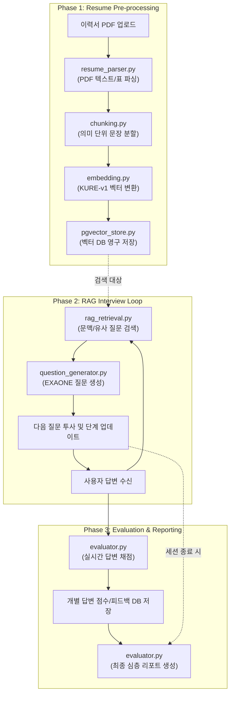

# 01. AI-Worker 전체 진행 순서도 (Workflow)

본 문서는 `ai-worker/tasks` 내의 핵심 모듈들이 어떻게 유기적으로 연결되어 이력서 처리부터 실시간 인터뷰, 그리고 최종 평가까지 이어지는지를 기술합니다.

## 1. 전체 비즈니스 프로세스 맵

---

## 2. 모듈별 상세 데이터 흐름 (Data Pipeline)

### [Step 1] 이력서 인덱싱 (Offline Task)

사용자가 이력서를 업로드하면 백그라운드에서 즉시 실행되는 과정입니다.

1. **`resume_parser.py`**: `pdfplumber`를 사용하여 PDF에서 이름, 학력, 프로젝트 등 구조화된 데이터를 추출합니다.
2. **`chunking.py`**: 추출된 긴 텍스트를 랭체인의 스플리터를 사용해 검색에 최적인 600자 내외로 쪼갭니다.
3. **`embedding.py`**: 쪼개진 텍스트 조각들을 고유한 숫자 벡터값으로 변환합니다.
4. **`pgvector_store.py`**: 벡터값과 텍스트 내용을 PostgreSQL의 `pgvector` 테이블에 저장하여 검색 준비를 마칩니다.

### [Step 2] 실시간 면접 진행 (Online Task)

면접이 시작되면 지원자의 답변에 따라 동적으로 질문이 생성되는 과정입니다.

1. **`rag_retrieval.py`**: 지원자의 직전 답변과 이력서 내용을 대조하여, 가장 관련 깊은 '경험 조각'과 '질문 은행'의 내역을 검색합니다.
2. **`question_generator.py`**: 검색된 문맥(Context)과 현재 면접 단계(Stage)를 조합하여, 랭체인 LCEL 체인을 통해 최적의 꼬리질문을 생성합니다.

### [Step 3] AI 성적표 생성 (Evaluation Task)

면접이 진행되는 동안, 혹은 종료 직후 수행되는 분석 과정입니다.

1. **`evaluator.py (Step 1)`**: 면접 중 각 답변이 들어올 때마다 미리 정의된 루브릭(Rubric)에 따라 점수와 피드백을 계산합니다.
2. **`evaluator.py (Step 2)`**: 전체 면접이 종료되면 모든 답변 기록을 종합하여 기술 역량, 소통 능력, 성장 가능성 등 다각도의 최종 성적표를 생성합니다.

---

## 3. 핵심 아키텍처 특징

* **Decoupling(분리)**: 각 기능이 모듈별로 독립되어 있어, 임베딩 모델을 바꾸거나 DB 저장 방식을 바꿔도 전체 로직에 영향을 주지 않습니다.
* **LangChain Native**: 모든 데이터 흐름이 랭체인 인터페이스를 통과하므로 모델 교체 및 파이프라인 확장이 용이합니다.
* **Event-Driven**: Celery 워커(Worker) 구조를 통해 무거운 AI 연산이 웹 서버의 성능을 저하시키지 않도록 설계되었습니다.
